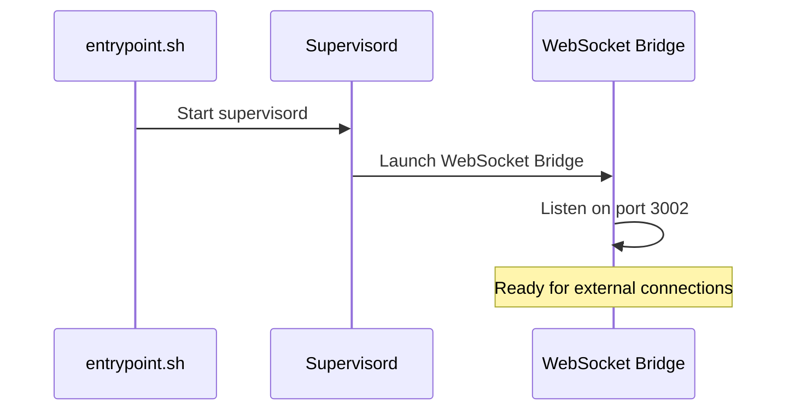
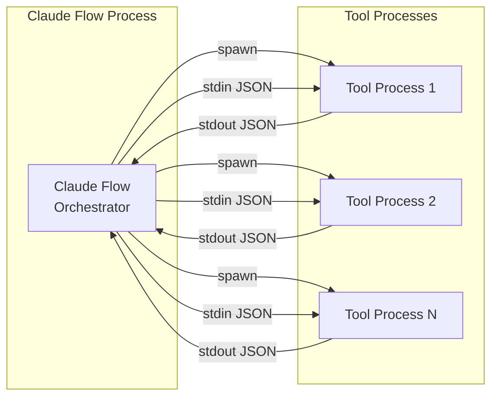
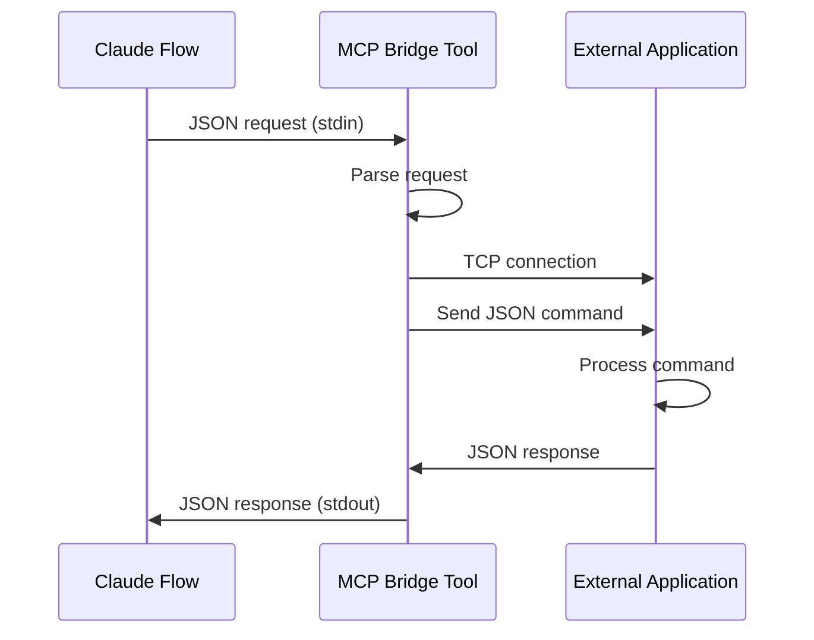
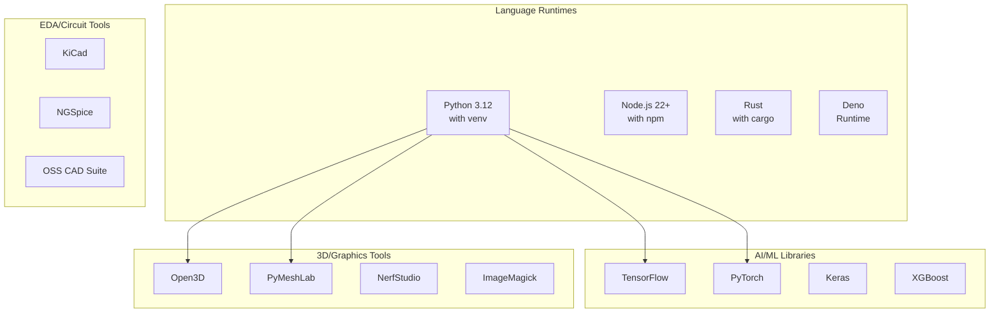
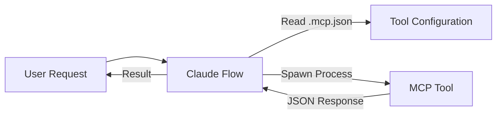
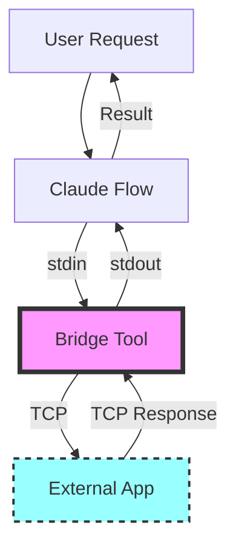

# Multi-Agent Docker Environment Architecture

## Overview

This document describes the architecture of the Multi-Agent Docker Environment, a sophisticated containerized development platform that integrates Claude Flow, MCP (Model Context Protocol) tools, and external application bridges.

## System Architecture

```mermaid
graph TB
    subgraph "Docker Container"
        subgraph "Process Management"
            SUPERVISOR[Supervisord]
            WS_BRIDGE[WebSocket Bridge<br/>Port 3002]
        end

        subgraph "MCP Tool Management"
            CLAUDE_FLOW[Claude Flow<br/>Tool Orchestrator]

            subgraph "Stdio-based Tools"
                BLENDER_TOOL[Blender MCP Tool]
                QGIS_TOOL[QGIS MCP Tool]
                IMAGEMAGICK_TOOL[ImageMagick Tool]
                NGSPICE_TOOL[NGSpice Tool]
                KICAD_TOOL[KiCad Tool]
                PBR_TOOL[PBR Generator Tool]
            end
        end

        subgraph "Development Environment"
            WORKSPACE[/workspace]
            PYTHON_ENV[Python 3.12 venv]
            NODE_ENV[Node.js 22+]
            RUST_ENV[Rust Toolchain]
            DENO_ENV[Deno Runtime]
        end
    end

    subgraph "External Applications"
        EXT_BLENDER[External Blender<br/>Port 9876]
        EXT_QGIS[External QGIS<br/>Port 9877]
    end

    subgraph "External Control"
        EXTERNAL_CLIENT[External Control System]
    end

    SUPERVISOR --> WS_BRIDGE
    CLAUDE_FLOW --> BLENDER_TOOL
    CLAUDE_FLOW --> QGIS_TOOL
    CLAUDE_FLOW --> IMAGEMAGICK_TOOL
    CLAUDE_FLOW --> NGSPICE_TOOL
    CLAUDE_FLOW --> KICAD_TOOL
    CLAUDE_FLOW --> PBR_TOOL

    BLENDER_TOOL -.->|TCP| EXT_BLENDER
    QGIS_TOOL -.->|TCP| EXT_QGIS

    EXTERNAL_CLIENT -.->|WebSocket| WS_BRIDGE

    WORKSPACE --> PYTHON_ENV
    WORKSPACE --> NODE_ENV
    WORKSPACE --> RUST_ENV
    WORKSPACE --> DENO_ENV
```

## Component Details

### 1. Process Management Layer

#### Supervisord
- **Purpose**: Manages long-running background services
- **Managed Services**: Currently only the WebSocket Bridge
- **Configuration**: `/etc/supervisor/conf.d/supervisord.conf`
- **Logs**: `/app/mcp-logs/`



### 2. MCP Tool Layer

#### Claude Flow
- **Purpose**: Orchestrates all MCP tools via stdio protocol
- **Configuration**: `.mcp.json` in workspace
- **Tool Communication**: JSON over stdio (stdin/stdout)

#### MCP Tools Architecture



### 3. Bridge Pattern for External Applications

The Blender and QGIS tools implement a bridge pattern to connect Claude Flow (stdio) with external applications (TCP):



### 4. Development Environment

The container includes a comprehensive development stack:



## Data Flow

### 1. Tool Invocation Flow



### 2. External Application Bridge Flow



## File Structure

```
/
├── app/
│   ├── core-assets/
│   │   ├── mcp.json          # MCP tool definitions
│   │   ├── mcp-tools/        # Python-based MCP tools
│   │   │   ├── qgis_mcp.py
│   │   │   ├── imagemagick_mcp.py
│   │   │   ├── ngspice_mcp.py
│   │   │   ├── kicad_mcp.py
│   │   │   └── pbr_generator_mcp.py
│   │   └── scripts/          # Node.js-based tools
│   │       ├── mcp-blender-client.js
│   │       ├── mcp-ws-relay.js
│   │       └── package.json
│   ├── mcp-logs/            # Supervisord logs
│   └── setup-workspace.sh   # Workspace initialization
├── workspace/               # User workspace
├── etc/
│   └── supervisor/
│       └── conf.d/
│           └── supervisord.conf
└── home/
    └── dev/                # User home directory
        ├── .deno/
        ├── .local/
        └── .npm-global/
```

## Security Considerations

1. **Process Isolation**: Each MCP tool runs as a separate process with limited permissions
2. **User Permissions**: All tools run as the `dev` user, not root
3. **Port Exposure**: Only necessary ports are exposed (3000, 3002, 9876, 9877)
4. **External Connections**: Bridge tools validate and sanitize data before forwarding

## Performance Optimizations

1. **Lazy Loading**: Tools are only spawned when needed by Claude Flow
2. **Stdio Communication**: Efficient JSON streaming between processes
3. **Minimal Background Services**: Only WebSocket bridge runs continuously
4. **Optimized Docker Layers**: Efficient caching during builds

## Extensibility

### Adding New MCP Tools

1. Create tool script in `/app/core-assets/mcp-tools/`
2. Implement stdio JSON protocol
3. Add tool definition to `.mcp.json`
4. Tools are automatically available after workspace setup

### Example Tool Structure

```python
#!/usr/bin/env python3
import sys
import json

def main():
    for line in sys.stdin:
        try:
            request = json.loads(line)
            # Process request
            response = {"result": "processed"}
            sys.stdout.write(json.dumps(response) + '\n')
            sys.stdout.flush()
        except Exception as e:
            error = {"error": str(e)}
            sys.stdout.write(json.dumps(error) + '\n')
            sys.stdout.flush()

if __name__ == "__main__":
    main()
```

## Troubleshooting

### Common Issues

1. **Supervisord Connection Refused**
   - Check if supervisord is running: `ps aux | grep supervisord`
   - Verify socket exists: `ls -la /workspace/.supervisor/`

2. **MCP Tool Not Found**
   - Verify tool is defined in `.mcp.json`
   - Check Claude Flow tools: `./node_modules/.bin/claude-flow mcp tools`

3. **External Application Connection Failed**
   - Ensure external application is running
   - Check network connectivity
   - Verify port numbers match configuration

### Debugging Commands

```bash
# Check supervisord status
supervisorctl -c /etc/supervisor/conf.d/supervisord.conf status

# View supervisord logs
tail -f /app/mcp-logs/supervisord.log

# Test MCP tool directly
echo '{"tool": "test", "params": {}}' | python3 ./mcp-tools/tool_name.py

# Check Claude Flow configuration
./node_modules/.bin/claude-flow mcp status
```

## Future Enhancements

1. **Service Discovery**: Automatic detection of external applications
2. **Load Balancing**: Multiple instances of tools for parallel processing
3. **Monitoring**: Prometheus metrics for tool usage and performance
4. **Hot Reload**: Dynamic tool updates without container restart