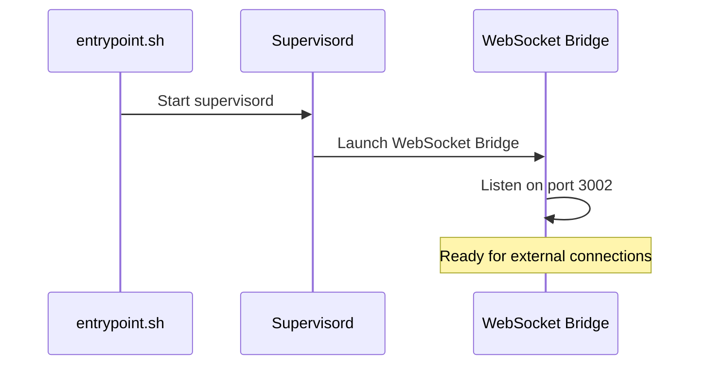
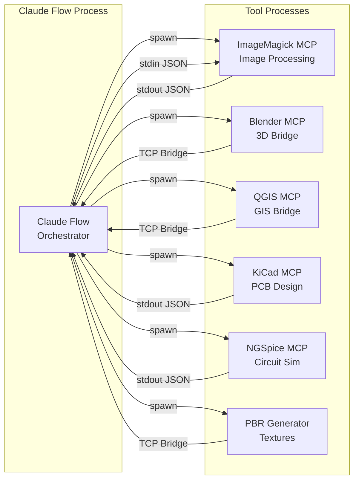
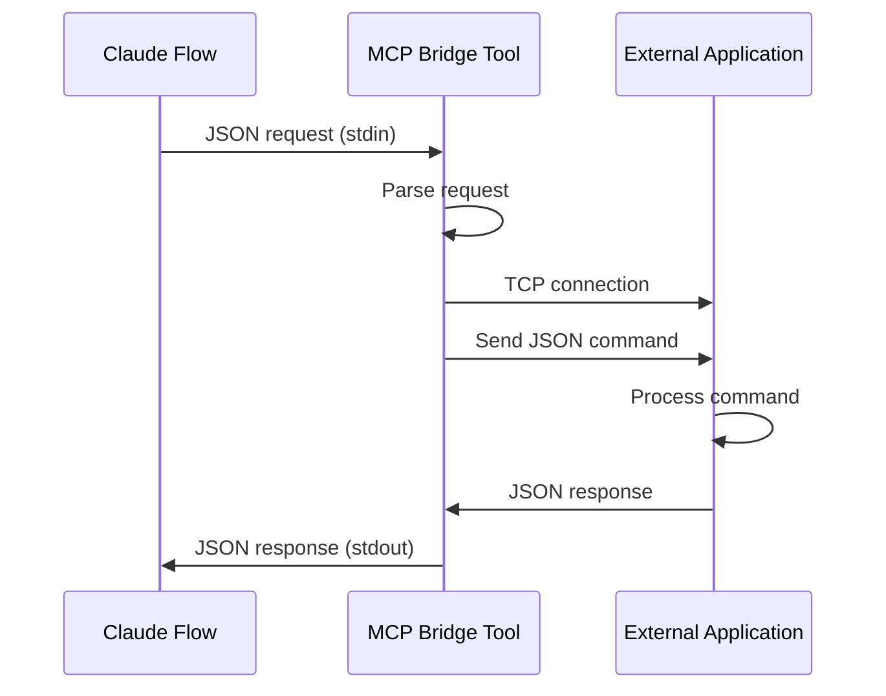
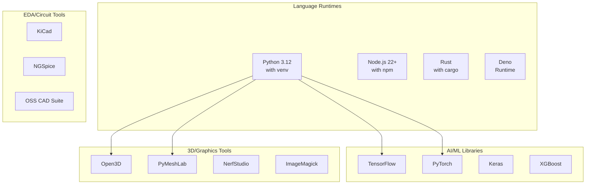
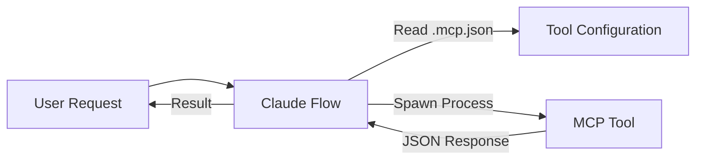
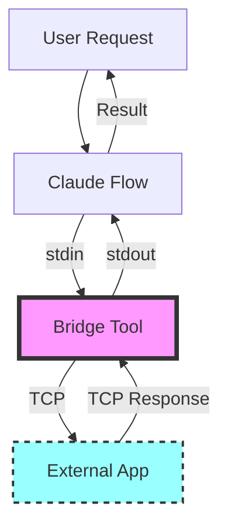

# Multi-Agent Docker Environment Architecture

## Overview

This document describes the architecture of the Multi-Agent Docker Environment, a sophisticated containerized development platform that integrates Claude Flow, MCP (Model Context Protocol) tools, and external application bridges.

## System Architecture

```mermaid
graph TB
    subgraph "Docker Container"
        subgraph "Process Management"
            SUPERVISOR[Supervisord]
            WS_BRIDGE[WebSocket Bridge<br/>Port 3002]
        end

        subgraph "MCP Tool Management"
            CLAUDE_FLOW[Claude Flow<br/>Tool Orchestrator]

            subgraph "Stdio-based Tools"
                BLENDER_TOOL[Blender MCP Tool<br/>3D modeling & rendering]
                QGIS_TOOL[QGIS MCP Tool<br/>Geospatial analysis]
                IMAGEMAGICK_TOOL[ImageMagick Tool<br/>Image processing]
                NGSPICE_TOOL[NGSpice Tool<br/>Circuit simulation]
                KICAD_TOOL[KiCad Tool<br/>PCB design]
                PBR_TOOL[PBR Generator Tool<br/>Texture generation]
            end
        end

        subgraph "Development Environment"
            WORKSPACE[/workspace]
            PYTHON_ENV[Python 3.12 venv]
            NODE_ENV[Node.js 22+]
            RUST_ENV[Rust Toolchain]
            DENO_ENV[Deno Runtime]
        end
    end

    subgraph "External Applications (gui-tools-docker)"
        EXT_BLENDER[External Blender<br/>Port 9876]
        EXT_QGIS[External QGIS<br/>Port 9877]
        EXT_PBR[PBR Generator Service<br/>Port 9878]
    end

    subgraph "External Control"
        EXTERNAL_CLIENT[External Control System]
    end

    SUPERVISOR --> WS_BRIDGE
    CLAUDE_FLOW --> BLENDER_TOOL
    CLAUDE_FLOW --> QGIS_TOOL
    CLAUDE_FLOW --> IMAGEMAGICK_TOOL
    CLAUDE_FLOW --> NGSPICE_TOOL
    CLAUDE_FLOW --> KICAD_TOOL
    CLAUDE_FLOW --> PBR_TOOL

    BLENDER_TOOL -.->|TCP| EXT_BLENDER
    QGIS_TOOL -.->|TCP| EXT_QGIS
    PBR_TOOL -.->|TCP| EXT_PBR

    EXTERNAL_CLIENT -.->|WebSocket| WS_BRIDGE

    WORKSPACE --> PYTHON_ENV
    WORKSPACE --> NODE_ENV
    WORKSPACE --> RUST_ENV
    WORKSPACE --> DENO_ENV
```

## Component Details

### 1. Process Management Layer

#### Supervisord
- **Purpose**: Manages long-running background services
- **Managed Services**: WebSocket Bridge (mcp-ws-relay)
- **Configuration**: `/etc/supervisor/conf.d/supervisord.conf`
- **Logs**: `/app/mcp-logs/`
- **User Management**: Runs as `dev` user with proper socket permissions



### 2. MCP Tool Layer

#### Claude Flow
- **Purpose**: Orchestrates all MCP tools via stdio protocol
- **Configuration**: `.mcp.json` in workspace
- **Tool Communication**: JSON over stdio (stdin/stdout)

#### MCP Tools Architecture



### 3. Bridge Pattern for External Applications

The Blender, QGIS, and PBR Generator tools implement a bridge pattern to connect Claude Flow (stdio) with external applications (TCP):



### 4. Development Environment

The container includes a comprehensive development stack:



## Data Flow

### 1. Tool Invocation Flow



### 2. External Application Bridge Flow



## File Structure
The environment uses a two-part file structure to separate the immutable core system from the dynamic user workspace.

```
/
├── app/
│   ├── core-assets/
│   │   ├── mcp.json          # [Source] MCP tool definitions
│   │   ├── mcp-tools/        # [Source] Python-based MCP tools
│   │   └── scripts/          # [Source] Node.js-based tools
│   ├── mcp-logs/             # Supervisord logs
│   └── setup-workspace.sh    # Workspace initialization script
│
├── workspace/                # [User Workspace] (Mounted Volume)
│   ├── .mcp.json             # Copied from /app/core-assets by setup script
│   ├── mcp-tools/            # Copied from /app/core-assets
│   ├── scripts/              # Copied from /app/core-assets
│   ├── node_modules/         # claude-flow installed here
│   └── ...                   # User-generated files and projects
│
├── etc/
│   └── supervisor/
│       └── conf.d/
│           └── supervisord.conf
│
└── home/
    └── dev/                # User home directory
        ├── .deno/
        ├── .local/
        └── .npm-global/
```

## Security Considerations

1. **Process Isolation**: Each MCP tool runs as a separate process with limited permissions
2. **User Permissions**: All tools run as the `dev` user, not root
3. **Port Exposure**: Only necessary ports are exposed (3000, 3002, 9876, 9877, 9878)
4. **External Connections**: Bridge tools validate and sanitize data before forwarding

## Performance Optimizations

1. **Lazy Loading**: Tools are only spawned when needed by Claude Flow
2. **Stdio Communication**: Efficient JSON streaming between processes
3. **Minimal Background Services**: Only WebSocket bridge runs continuously
4. **Optimized Docker Layers**: Efficient caching during builds

## Extensibility

### Adding New MCP Tools

1. Create tool script in `/app/core-assets/mcp-tools/` (Python) or `/app/core-assets/scripts/` (Node.js)
2. Implement stdio JSON protocol (see existing tools as examples)
3. Add tool definition to `/app/core-assets/mcp.json`
4. Make script executable and add `-u` flag for Python (unbuffered output)
5. Run `/app/setup-workspace.sh --force` to update workspace
6. Tools are automatically available via `./mcp-helper.sh`

### Current MCP Tools

| Tool | File | Purpose |
|------|------|---------|
| **imagemagick-mcp** | `imagemagick_mcp.py` | Image creation and manipulation |
| **blender-mcp** | `mcp-blender-client.js` | 3D modeling bridge to external Blender |
| **qgis-mcp** | `qgis_mcp.py` | Geospatial analysis bridge to external QGIS |
| **kicad-mcp** | `kicad_mcp.py` | Electronic design automation |
| **ngspice-mcp** | `ngspice_mcp.py` | Circuit simulation |
| **pbr-generator-mcp** | `pbr_mcp_client.py` | PBR texture generation bridge to external service |

### Example Tool Structure

```python
#!/usr/bin/env python3
import sys
import json

def main():
    for line in sys.stdin:
        try:
            request = json.loads(line)
            # Process request
            response = {"result": "processed"}
            sys.stdout.write(json.dumps(response) + '\n')
            sys.stdout.flush()
        except Exception as e:
            error = {"error": str(e)}
            sys.stdout.write(json.dumps(error) + '\n')
            sys.stdout.flush()

if __name__ == "__main__":
    main()
```

## Troubleshooting

### Common Issues

1. **Supervisord Connection Refused**
   - Check if supervisord is running: `ps aux | grep supervisord`
   - Verify socket exists: `ls -la /workspace/.supervisor/`

2. **MCP Tool Not Found**
   - Verify tool is defined in `.mcp.json`
   - Check Claude Flow tools: `./node_modules/.bin/claude-flow mcp tools`

3. **External Application Connection Failed**
   - Ensure external application is running
   - Check network connectivity
   - Verify port numbers match configuration

### Debugging Commands

```bash
# Check supervisord status
supervisorctl -c /etc/supervisor/conf.d/supervisord.conf status

# View supervisord logs
tail -f /app/mcp-logs/supervisord.log

# List all available MCP tools
./mcp-helper.sh list-tools

# Test all tools automatically
./mcp-helper.sh test-all

# Test specific MCP tool directly
echo '{"tool": "create", "params": {"width": 100, "height": 100, "color": "red", "output": "test.png"}}' | python3 ./mcp-tools/imagemagick_mcp.py

# Check Claude Flow configuration
./node_modules/.bin/claude-flow mcp tools --file ./.mcp.json

# Get Claude usage instructions
./mcp-helper.sh claude-instructions
```

## Future Enhancements

1.  **Service Discovery**: Implement automatic detection and registration of external applications.
2.  **Load Balancing**: Support multiple instances of tools for parallel processing and improved performance.
3.  **Monitoring**: Integrate Prometheus metrics for detailed insights into tool usage and performance.
4.  **Hot Reload**: Enable dynamic updates to tools and configurations without requiring container restarts.
5.  **Vision Model Integration**: Deploy a local vision model in the `gui-tools-container` to provide real-time visual descriptions of GUI application states to the AI agents. This involves selecting, optimizing, and deploying a suitable model and designing an efficient data streaming mechanism.
6.  **Revit Model Parsing and Conversion**: Implement a tool to parse Revit models (`.rvt` files) and convert their data into a Blender-compatible format, preserving semantic information. This requires a deep understanding of both Revit's data model and Blender's API, likely involving external libraries and custom parsers.

## Testing and Validation

To ensure the robustness and functionality of the integrated tools, especially those interacting with external GUI applications, the following testing scenarios are recommended:

1.  **Gemini CLI Integration Test**:
    -   **Objective**: Verify that the Gemini CLI tool can be successfully invoked and performs its intended function within the `multi-agent-container`.
    -   **Scenario**: Execute a simple Gemini CLI command (e.g., `gemini --version` or a basic text generation request if configured) and confirm successful output.
    -   **Command Example**: `docker exec -it multi-agent-container gemini --version`
2.  **Codex Integration Test**:
    -   **Objective**: Confirm that the OpenAI Codex tool is correctly set up and can process code-related requests.
    -   **Scenario**: Use a simple Codex command (e.g., a code completion or explanation request) and validate the response.
    -   **Command Example**: `docker exec -it multi-agent-container codex --help` (or a more specific command if an API key is configured)
3.  **PBR Texture Creation and Live Model Integration in Blender**:
    -   **Objective**: Validate the end-to-end workflow of generating PBR textures and applying them to a live 3D model within Blender via the MCP bridge.
    -   **Scenario**:
        1.  From the `multi-agent-container`, use `pbr-generator-mcp` to generate a set of PBR textures (e.g., diffuse, normal, roughness) for a specified material.
        2.  Within the same `multi-agent-container`, use `blender-mcp` to:
            -   Create a simple 3D object (e.g., a cube or sphere) in Blender.
            -   Import the newly generated PBR textures into Blender.
            -   Apply these textures to the created 3D object, ensuring the material nodes are correctly set up.
            -   Capture a viewport screenshot of the textured object to visually confirm the application.
    -   **Command Examples**:
        -   Generate PBR textures: `./mcp-helper.sh run-tool pbr-generator-mcp '{"tool": "generate_material", "params": {"material": "wood", "resolution": "512x512", "types": ["diffuse", "normal", "roughness"], "output": "/workspace/pbr_outputs"}}'`
        -   Create object in Blender: `./mcp-helper.sh run-tool blender-mcp '{"type": "execute_code", "params": {"code": "bpy.ops.mesh.primitive_cube_add(size=2)"}}'`
        -   Import and apply textures (requires more complex `execute_code` or a dedicated `set_pbr_material` method in `addon.py`): This would involve a sequence of `blender-mcp` calls to load images, create a material, and link nodes.
        -   Get screenshot: `./mcp-helper.sh run-tool blender-mcp '{"type": "get_viewport_screenshot", "params": {"filepath": "/workspace/textured_cube.png"}}'`