# Multi-Agent Docker Environment

[](https://www.docker.com/)
[](https://github.com/claude-flow/claude-flow)
[](https://modelcontextprotocol.io/)
[](https://www.python.org/)
[](https://nodejs.org/)

This project provides a sophisticated, multi-container Docker environment designed for AI agents. It orchestrates both local CLI tools and external GUI applications using the Model Context Protocol (MCP), enabling advanced AI-driven development workflows.

## ✨ Key Features

- **Dual-Container Architecture**: Separates core AI logic and CLI tools from resource-intensive GUI applications.
- **Rich Development Environment**: A polyglot environment with runtimes for Python, Node.js, Rust, and Deno, equipped with extensive tooling for AI/ML, 3D graphics, EDA, document processing, and network analysis.
- **Flexible MCP Connectivity**: Supports both WebSocket (port 3002) and high-performance TCP (port 9500) for MCP communication.
- **Comprehensive AI Tooling**: Includes a full suite of AI/ML libraries (PyTorch, TensorFlow), GPU acceleration with the CUDA Toolkit, and CLIs for major AI models (Gemini, OpenAI Codex, Anthropic Claude).
- **Advanced Hardware Acceleration**: Supports GPU-accelerated computing with CUDA and AI inference with the WasmEdge runtime and its OpenVINO backend.
- **MCP-based Orchestration**: Utilises the Model Context Protocol for seamless interaction between AI agents and a wide array of specialised tools.
- **External Application Bridges**: Employs TCP-based bridges for robust communication with external GUI applications (Blender, QGIS) running in a dedicated container.
- **Automated & Customisable Setup**: Features helper scripts for easy workspace initialisation and a user-centric configuration that aligns container permissions with the host system.

## 🎬 Demonstration

Here is a demonstration of the Blender MCP tool in action, creating a complex 3D scene programmatically.

**Screenshot:**


**Demonstration:**


## 🚀 Quick Start

To get the environment up and running, follow these steps:

1.  **Clone the repository**:
    ```bash
    git clone <repository-url> && cd multi-agent-docker
    ```

2.  **Create the Docker network (if it doesn't exist)**:
    ```bash
    docker network create docker_ragflow || true
    ```

3.  **Build and start the containers**:
    ```bash
    docker-compose up --build -d
    ```

4.  **Access the multi-agent container shell**:
    ```bash
    docker exec -it multi-agent-container /bin/bash
    ```

5.  **Set up the workspace inside the container**:
    ```bash
    /app/setup-workspace.sh
    ```

6.  **Test all MCP tools**:
    ```bash
    ./mcp-helper.sh test-all
    ```

## 🔌 MCP Connectivity

This environment offers two primary ways to connect to the Model Context Protocol (MCP) server, catering to different needs for performance and accessibility.

### MCP TCP Server (Port 9500)

For high-performance, low-latency connections, a direct TCP server is available. This is the recommended method for inter-container communication or performance-critical applications.

-   **Port**: `9500` (configurable via `MCP_TCP_PORT`)
-   **Benefits**:
    -   **Performance**: Direct TCP is significantly faster than WebSocket, with lower overhead.
    -   **Simplicity**: No WebSocket protocol layer, making it easier to use with standard TCP clients.
    -   **Compatibility**: Works with any standard TCP client library in any language.

#### Usage (from another container)

```rust
use tokio::net::TcpStream;
use tokio::io::{AsyncBufReadExt, AsyncWriteExt, BufReader};

let mut stream = TcpStream::connect("multi-agent-container:9500").await?;
let mut reader = BufReader::new(stream.try_clone().await?);

// Send request
let request = r#"{"jsonrpc":"2.0","id":"1","method":"initialize","params":{}}"#;
stream.write_all(request.as_bytes()).await?;
stream.write_all(b"\n").await?;

// Read response
let mut response = String::new();
reader.read_line(&mut response).await?;
```

#### Management Commands (inside `multi-agent-container`)

-   `mcp-tcp-start`: Start the TCP server.
-   `mcp-tcp-stop`: Stop the TCP server.
-   `mcp-tcp-status`: Check the server status.
-   `mcp-tcp-restart`: Restart the server.
-   `mcp-tcp-logs`: View server logs.
-   `mcp-tcp-test`: Run a simple connection test.

### MCP WebSocket Bridge (Port 3002)

The existing WebSocket bridge remains available for clients that require or prefer a WebSocket connection.

-   **Port**: `3002`
-   **Use Cases**: Ideal for web-based clients or systems where TCP connections are restricted.

## 📊 Services Overview

| Service Name | Container Name | Purpose | Access |
| :--- | :--- | :--- | :--- |
| `multi-agent` | `multi-agent-container` | Orchestration, AI logic, CLI tools | `docker exec` |
| `gui-tools-service` | `gui-tools-container` | Runs heavy GUI apps (Blender, QGIS, PBR Generator) | VNC on `localhost:5901` |

## 🔧 Core Development Environment

Beyond the specialised MCP tools, this environment provides a rich, general-purpose development ecosystem. For a complete list of all available command-line tools, libraries, and runtimes, please see the **[Available Tooling Reference](./TOOLS.md)**.

Key components of the core environment include:

- **AI & Machine Learning**: PyTorch, TensorFlow, CUDA Toolkit, WasmEdge with OpenVINO.
- **3D, Graphics & Media**: FFmpeg, ImageMagick, Inkscape, Colmap.
- **Document Processing**: A full TeX Live installation with `latexmk`.
- **Runtimes**: Python 3.12, Node.js 22+, Rust, and Deno.
- **Build & Dev Tools**: Git, Docker, ShellCheck, Hadolint, Tmux.
- **Networking**: `nmap`, `tcpdump`, `traceroute`, and other essential utilities.

## 📚 Detailed Documentation

Explore the following documents for a deeper understanding of the project:

| Document | Description |
|---|---|
| 🚀 **[Quick Start Guide](./QUICKSTART.md)** | Step-by-step instructions to get the environment running. |
| 🛠️ **[Available Tooling Reference](./TOOLS.md)** | A complete reference for all integrated tools, libraries, and runtimes. |
| 🏗️ **[Architecture Overview](./ARCHITECTURE.md)** | Detailed explanation of the system's dual-container architecture and MCP tool layers. |
| 🌐 **[Networking Deep Dive](./NETWORKING.md)** | Comprehensive guide to the Docker networking model and service communication. |
| 🤖 **[Agent Technical Briefing](./AGENT-BRIEFING.md)** | Documentation specifically for AI agents, detailing their capabilities and interaction patterns. |
| 🔍 **[Troubleshooting Guide](./TROUBLESHOOTING.md)** | Solutions for common issues related to networking, VNC, and tool connectivity. |
| 📜 **[License](./LICENSE)** | The CC0 1.0 Universal license for this project. |

## 🖼️ Architecture Diagram



```mermaid
graph TD
    subgraph "Host Machine"
        User_WS[User/External System] -- WebSocket --> WS_Bridge(mcp-ws-relay.js:3002)
        User_TCP[User/External System] -- TCP --> TCP_Server(mcp-tcp-server.js:9500)
        User_VNC[User/External System] -- VNC --> VNC_Access(localhost:5901)
    end

    subgraph "Docker Network: docker_ragflow"
        subgraph "multi-agent-container"
            MA_Container(Multi-Agent Container)
            TCP_Server -- Stdio --> ClaudeFlow_TCP(claude-flow)
            WS_Bridge -- Stdio --> ClaudeFlow_WS(claude-flow)
            
            MA_Container -- TCP --> Blender_Client(mcp-blender-client.js)
            MA_Container -- TCP --> QGIS_Client(qgis_mcp.py)
            MA_Container -- TCP --> PBR_Client(pbr_mcp_client.py)
            MA_Container -- Stdio --> ImageMagick(imagemagick_mcp.py)
            MA_Container -- Stdio --> KiCad(kicad_mcp.py)
            MA_Container -- Stdio --> NGSpice(ngspice_mcp.py)
            MA_Container -- Stdio --> RuvSwarm(ruv-swarm)
            MA_Container -- Stdio --> GeminiCLI(gemini-cli)
            MA_Container -- Stdio --> OpenAI_Codex(openai-codex)
            MA_Container -- Stdio --> Anthropic_Claude(anthropic-claude)
        end

        subgraph "gui-tools-container"
            GUI_Container(GUI Tools Container)
            GUI_Container -- TCP --> Blender_Server(addon.py:9876)
            GUI_Container -- TCP --> QGIS_Server(QGIS MCP Plugin:9877)
            GUI_Container -- TCP --> PBR_Server(pbr_mcp_server.py:9878)
            GUI_Container -- VNC --> XFCE_Desktop(XFCE Desktop)
            GUI_Container -- VNC --> Blender_App(Blender)
            GUI_Container -- VNC --> QGIS_App(QGIS)
            GUI_Container -- VNC --> PBR_Generator(Tessellating PBR Generator)
        end

        MA_Container -- Network --> GUI_Container
        GUI_Container -- Network --> MA_Container
    end

    style MA_Container fill:#f9f,stroke:#333,stroke-width:2px
    style GUI_Container fill:#ccf,stroke:#333,stroke-width:2px
    style WS_Bridge fill:#afa,stroke:#333,stroke-width:2px
    style TCP_Server fill:#afa,stroke:#333,stroke-width:2px
    style VNC_Access fill:#afa,stroke:#333,stroke-width:2px
```

## 📜 License

This project is released into the public domain under the [CC0 1.0 Universal (CC0 1.0) Public Domain Dedication](LICENSE).