# Multi-Agent Docker Environment

[](https://www.docker.com/)
[](https://github.com/claude-flow/claude-flow)
[](https://modelcontextprotocol.io/)
[](https://www.python.org/)
[](https://nodejs.org/)

This project provides a sophisticated, multi-container Docker environment designed for AI agents. It orchestrates both local CLI tools and external GUI applications using the Model Context Protocol (MCP), enabling advanced AI-driven development workflows.

## ✨ Key Features

- **Dual-Container Architecture**: Separates core AI logic and CLI tools from resource-intensive GUI applications.
- **Comprehensive Toolset**: Integrates a wide range of tools including 3D modeling (Blender), Electronic Design Automation (KiCad, NGSpice), Geospatial Information Systems (QGIS), image processing (ImageMagick), and Physically Based Rendering (PBR) texture generation.
- **MCP-based Communication**: Utilizes the Model Context Protocol for seamless interaction between AI agents and diverse tools.
- **External Application Bridges**: Employs TCP-based bridges for robust communication with external GUI applications running in a dedicated container.
- **Modern Development Stack**: Built on Python 3.12, Node.js 22+, Rust, and Deno runtimes.
- **Automated Setup**: Streamlined workspace initialization with helper scripts.
- **AI-Ready**: Designed for automatic knowledge integration and orchestration by AI agents.

## 🎬 Demonstration

Here is a demonstration of the Blender MCP tool in action, creating a complex 3D scene programmatically.

**Screenshot:**


**Demonstration:**


## 🚀 Quick Start

To get the environment up and running, follow these steps:

1.  **Clone the repository**:
    ```bash
    git clone <repository-url> && cd multi-agent-docker
    ```

2.  **Create the Docker network (if it doesn't exist)**:
    ```bash
    docker network create docker_ragflow || true
    ```

3.  **Build and start the containers**:
    ```bash
    docker-compose up --build -d
    ```

4.  **Access the multi-agent container shell**:
    ```bash
    docker exec -it multi-agent-container /bin/bash
    ```

5.  **Set up the workspace inside the container**:
    ```bash
    /app/setup-workspace.sh
    ```

6.  **Test all MCP tools**:
    ```bash
    ./mcp-helper.sh test-all
    ```

## 📊 Services Overview

| Service Name | Container Name | Purpose | Access |
| :--- | :--- | :--- | :--- |
| `multi-agent` | `multi-agent-container` | Orchestration, AI logic, CLI tools | `docker exec` |
| `gui-tools-service` | `gui-tools-container` | Runs heavy GUI apps (Blender, QGIS, PBR Generator) | VNC on `localhost:5901` |

## 📚 Detailed Documentation

Explore the following documents for a deeper understanding of the project:

| Document | Description |
|---|---|
| 🚀 **[Quick Start Guide](./QUICKSTART.md)** | Step-by-step instructions to get the environment running. |
| 🏗️ **[Architecture Overview](./ARCHITECTURE.md)** | Detailed explanation of the system's dual-container architecture, process management, and MCP tool layers. |
| 🌐 **[Networking Deep Dive](./NETWORKING.md)** | Comprehensive guide to the Docker networking model, service communication, and port mappings. |
| 🛠️ **[MCP Tool Reference](./TOOLS.md)** | A complete reference for all integrated MCP tools, their capabilities, and usage examples. |
| 🤖 **[Agent Technical Briefing](./AGENT-BRIEFING.md)** | Documentation specifically for AI agents, detailing their capabilities and interaction patterns. |
| 🔍 **[Troubleshooting Guide](./TROUBLESHOOTING.md)** | Solutions for common issues related to networking, VNC, and tool connectivity. |
| 🗑️ **[Waste Code Analysis](./WASTE_CODE.md)** | A review of redundant and unnecessary files in the project. |
| 📜 **[License](./LICENSE)** | The CC0 1.0 Universal license for this project. |

## 🖼️ Architecture Diagram



```mermaid
graph TD
    subgraph "Host Machine"
        User[User/External System] -- WebSocket --> WS_Bridge(mcp-ws-relay.js:3002)
        User -- VNC --> VNC_Access(localhost:5901)
    end

    subgraph "Docker Network: docker_ragflow"
        subgraph "multi-agent-container"
            MA_Container(Multi-Agent Container)
            MA_Container -- TCP --> Blender_Client(mcp-blender-client.js)
            MA_Container -- TCP --> QGIS_Client(qgis_mcp.py)
            MA_Container -- TCP --> PBR_Client(pbr_mcp_client.py)
            MA_Container -- Stdio --> ImageMagick(imagemagick_mcp.py)
            MA_Container -- Stdio --> KiCad(kicad_mcp.py)
            MA_Container -- Stdio --> NGSpice(ngspice_mcp.py)
            MA_Container -- Stdio --> ClaudeFlow(claude-flow)
            MA_Container -- Stdio --> RuvSwarm(ruv-swarm)
            MA_Container -- Stdio --> GeminiCLI(gemini-cli)
            MA_Container -- Stdio --> OpenAI_Codex(openai-codex)
            MA_Container -- Stdio --> Anthropic_Claude(anthropic-claude)
            WS_Bridge -- Stdio --> ClaudeFlow
        end

        subgraph "gui-tools-container"
            GUI_Container(GUI Tools Container)
            GUI_Container -- TCP --> Blender_Server(addon.py:9876)
            GUI_Container -- TCP --> QGIS_Server(QGIS MCP Plugin:9877)
            GUI_Container -- TCP --> PBR_Server(pbr_mcp_server.py:9878)
            GUI_Container -- VNC --> XFCE_Desktop(XFCE Desktop)
            GUI_Container -- VNC --> Blender_App(Blender)
            GUI_Container -- VNC --> QGIS_App(QGIS)
            GUI_Container -- VNC --> PBR_Generator(Tessellating PBR Generator)
        end

        MA_Container -- Network --> GUI_Container
        GUI_Container -- Network --> MA_Container
    end

    style MA_Container fill:#f9f,stroke:#333,stroke-width:2px
    style GUI_Container fill:#ccf,stroke:#333,stroke-width:2px
    style WS_Bridge fill:#afa,stroke:#333,stroke-width:2px
    style VNC_Access fill:#afa,stroke:#333,stroke-width:2px
    style Blender_Client fill:#ffc,stroke:#333,stroke-width:1px
    style QGIS_Client fill:#ffc,stroke:#333,stroke-width:1px
    style PBR_Client fill:#ffc,stroke:#333,stroke-width:1px
    style ImageMagick fill:#ffc,stroke:#333,stroke-width:1px
    style KiCad fill:#ffc,stroke:#333,stroke-width:1px
    style NGSpice fill:#ffc,stroke:#333,stroke-width:1px
    style ClaudeFlow fill:#ffc,stroke:#333,stroke-width:1px
    style RuvSwarm fill:#ffc,stroke:#333,stroke-width:1px
    style GeminiCLI fill:#ffc,stroke:#333,stroke-width:1px
    style OpenAI_Codex fill:#ffc,stroke:#333,stroke-width:1px
    style Anthropic_Claude fill:#ffc,stroke:#333,stroke-width:1px
    style Blender_Server fill:#ffc,stroke:#333,stroke-width:1px
    style QGIS_Server fill:#ffc,stroke:#333,stroke-width:1px
    style PBR_Server fill:#ffc,stroke:#333,stroke-width:1px
    style XFCE_Desktop fill:#ffc,stroke:#333,stroke:#333,stroke-width:1px
    style Blender_App fill:#ffc,stroke:#333,stroke-width:1px
    style QGIS_App fill:#ffc,stroke:#333,stroke-width:1px
    style PBR_Generator fill:#ffc,stroke:#333,stroke-width:1px
```

## 📜 License

This project is released into the public domain under the [CC0 1.0 Universal (CC0 1.0) Public Domain Dedication](LICENSE).