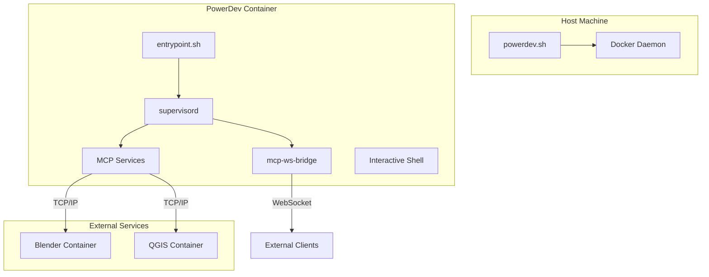

# PowerDev: The AI-Accelerated Development Environment

[](https://www.docker.com/)
[](https://github.com/claude-flow/claude-flow)
[](https://www.nvidia.com/en-us/gpu-cloud/)

**PowerDev** is a fully containerized, high-performance development environment designed for building, testing, and deploying complex applications with the power of AI. It provides a unified, extensible platform for AI-driven software development, data analysis, and systems engineering, centered around the `claude-flow` agent orchestration framework.

## ✨ Key Features

- **Unified & Extensible:** A single, coherent environment with a rich, and growing, set of integrated tools.
- **AI-Powered:** Built around `claude-flow` for swarm-based AI development and automation.
- **Decoupled & Clean:** A modular architecture that connects to external services like Blender and QGIS, keeping the core environment lean and focused.
- **Rich Tooling:** A comprehensive suite of pre-installed tools for EDA, 2D/3D graphics, and geospatial analysis.
- **Reproducible:** Get a clean, fully-provisioned workspace every time with a single command.
- **GPU Accelerated:** Full NVIDIA GPU support for machine learning, scientific computing, and rendering.

## 🚀 Getting Started: The Startup Sequence

This guide will walk you through the complete startup sequence, from a fresh clone to a fully operational environment.

### Prerequisites

- **Docker:** The latest version of Docker Engine.
- **NVIDIA GPU Drivers:** Required on the host machine for GPU acceleration.
- **Bash-compatible Shell:** For running the `powerdev.sh` script.

### Step 1: Clone the Repository

```bash
git clone <repository-url>
cd <repository-directory>
```

### Step 2: Build the Docker Image

This command builds the Docker image from the `Dockerfile`. This is a one-time setup, and you only need to re-run it if you modify the `Dockerfile`.

```bash
./powerdev.sh build
```

### Step 3: Start the Container

This command starts the PowerDev container in the background and drops you into an interactive shell.

```bash
./powerdev.sh start
```

You are now inside the container, in an empty `/workspace` directory. The environment is running, but your workspace is a blank slate, ready to be configured.

### Step 4: Provision Your Workspace

This is the key step to set up your workspace for the first time. The `setup-workspace.sh` script copies all the necessary configurations from `core-assets` into your local `/workspace`, initializes `claude-flow`, and configures the MCP environment.

```bash
/app/setup-workspace.sh
```

After the script completes, your workspace will be fully provisioned and ready for development.

### Step 5: Grant Permissions

For the current session, you need to grant `claude-flow` the necessary permissions to operate.

```bash
claude --dangerously-skip-permissions
```

### Step 6: Verify the Environment

Check the status of the MCP servers to ensure everything is running correctly.

```bash
mcp-status
```

You are now ready to begin working with the AI swarm.

## 🏗️ Architecture Overview

PowerDev's architecture is designed for modularity, extensibility, and reproducibility.

- **`core-assets`:** The immutable, single source of truth for all configurations, scripts, and agent definitions.
- **`/workspace`:** Your ephemeral, personal workspace. It is populated by the `setup-workspace.sh` script and can be safely reset at any time.
- **External Services:** Heavy applications like Blender and QGIS are run in separate containers and connected to the PowerDev environment via MCP bridges.



## 🧰 The `powerdev.sh` Helper Script

This script is your main entry point for managing the environment.

| Command | Description |
|---|---|
| `build` | Builds the Docker image. |
| `start` | Starts the container and opens an interactive shell. |
| `stop` | Stops all running services. |
| `restart` | Restarts the container. |
| `status` | Shows the status of the container. |
| `logs` | Views the logs for the container. |
| `shell` | Opens a new shell in the running container. |
| `cleanup` | Removes the container and all associated volumes. |

## 🤖 The MCP Ecosystem

The PowerDev environment is built around a rich ecosystem of MCP servers, which provide the tools for the AI swarm to work with.

| Server | Description |
|---|---|
| `claude-flow` | The core AI swarm orchestration engine. |
| `ruv-swarm` | Advanced multi-agent management. |
| `mcp-ws-bridge` | WebSocket bridge for external clients to connect to the swarm. |
| `blender-tcp` | Bridge to an external Blender instance. |
| `kicad-mcp` | For electronic design automation with KiCad. |
| `ngspice-mcp` | For circuit simulation with NGSpice. |
| `imagemagick-mcp` | For advanced image manipulation. |
| `pbr-generator-mcp` | For creating physically-based rendering materials. |
| `qgis-mcp` | Bridge to an external QGIS instance for geospatial analysis. |

### Querying Extended MCP Services

After running the `setup-workspace.sh` script, you need to manually initialize the custom MCP servers. This is a crucial step to make the extended tools (like Blender, KiCad, etc.) available to the AI swarm.

From within the container's shell, run the following command:

```bash
claude-flow mcp init --file ./.mcp.json
```

This command reads your custom server definitions from `.mcp.json` and registers them with `claude-flow`.

Once this is done, you can see a full list of all available tools, including those from the custom servers, with the following command:

```bash
claude-flow mcp tools --verbose
```

This will provide a detailed list of all available tools, their parameters, and descriptions. You can then use these tools within the `claude` shell or via the `claude-flow` API.

## Troubleshooting

- **Build fails:** Ensure you have the latest version of Docker and that the Docker daemon is running.
- **Container fails to start:** Check the logs with `./powerdev.sh logs` for any error messages.
- **MCP server not running:** Check the status with `mcp-status` inside the container, and check the logs in `/app/mcp-logs/`.