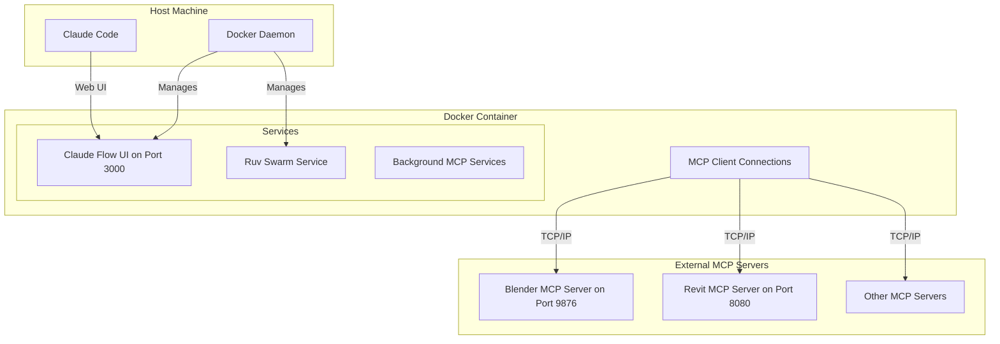
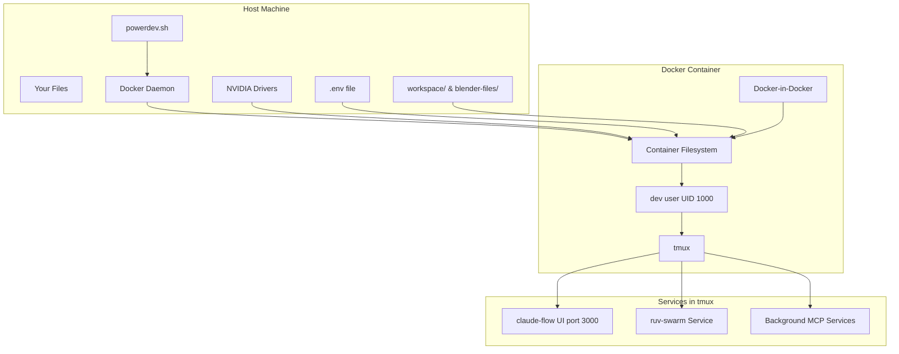

# PowerDev - High-Performance Development Environment

[](https://www.docker.com/)
[](https://github.com/claude-flow/claude-flow)
[](https://www.nvidia.com/en-us/gpu-cloud/)

This repository provides a fully containerized, high-performance development environment centered around **`claude-flow@alpha`** and **`ruv-swarm`**. It's designed for security, performance, and ease of use, bundling a comprehensive AI/ML stack with GPU acceleration, a robust security model, and persistent data storage.

## ✨ Key Features

- **`claude-flow@alpha` Ready**: The environment is built around `claude-flow` as the primary orchestration and development tool.
- **`ruv-swarm` Integration**: Multi-agent orchestration system running alongside claude-flow.
- **Comprehensive AI/ML Stack**: Includes Python 3.12/3.13 with TensorFlow, PyTorch, Keras, and more, all accelerated by CUDA 12.9.
- **GPU Accelerated**: Full NVIDIA GPU support (`--gpus all`) is enabled out-of-the-box for both ML tasks and WebGPU/Wasm workloads.
- **Robust Security Model**: The container runs with a hardened security profile, dropping all default capabilities and only adding back what is essential for development and debugging.
- **Persistent Data Storage**: Your workspace, data, logs, and outputs are safely persisted on the host machine in the `.agent-mount` directory.
- **Helper Script**: The `powerdev.sh` script simplifies all common Docker operations like building, running, and managing the container.
- **Remote MCP Connectivity**: Connect to external Blender, Revit, and other MCP servers while maintaining local development capabilities.

## 🏗️ Architecture Overview

The environment is designed with clear separation between the host, the container, and the services running inside.

### MCP Integration Architecture

The MCP integration enables powerful AI-driven workflows by connecting to remote MCP servers. The container includes MCP client capabilities for connecting to external Blender, Revit, and other 3D/design applications.



**Key Components:**

- **Claude Flow UI**: The main web interface for managing tasks and agents, running on port 3000.
- **Ruv Swarm**: Multi-agent orchestration running in background with logging.
- **MCP Client**: Connects to external MCP servers for Blender, Revit, and other applications.
- **Background Services**: Automated initialization and management of claude-flow and ruv-swarm.

**Communication Flow:**

1. **Startup**: The `entrypoint.sh` script initializes claude-flow and ruv-swarm in background tmux sessions.
2. **Connection**: MCP clients establish connections to external servers (Blender on 9876, etc.).
3. **Command Execution**: Commands are sent through MCP protocol to external applications.
4. **Response**: Results are returned through the MCP protocol for processing by AI agents.



## ⚙️ Prerequisites

- **Docker**: The latest version of Docker Engine with Docker Compose.
- **NVIDIA GPU Drivers**: Required on the host machine for GPU acceleration inside the container.
- **Bash-compatible Shell**: For running the `powerdev.sh` script (e.g., bash, zsh).

## 🚀 Quick Start

1. **Clone the Repository**:
   ```bash
   git clone <repository-url>
   cd <repository-directory>
   ```

2. **Configure Environment**:
   Copy the template to create your environment file and fill in your API keys.
   ```bash
   cp env_template .env
   nano .env
   ```

3. **Build the Image**:
   This command builds the Docker image. It only needs to be run once or when the `Dockerfile` changes.
   ```bash
   ./powerdev.sh build
   ```

4. **Start the Container**:
   This command starts the container and automatically opens an interactive shell.
   ```bash
   ./powerdev.sh start
   ```

5. **Access the UI**:
   Open your browser and navigate to **[http://localhost:3000](http://localhost:3000)** to access the `claude-flow` web interface.

## 🧰 The `powerdev.sh` Helper Script

This script is your main entry point for managing the environment.

| Command                 | Description                                                              |
| ----------------------- | ------------------------------------------------------------------------ |
| `build [--no-cache]`    | Builds the Docker image from the `Dockerfile`.                          |
| `start [profile...]`    | Starts the container and automatically opens an interactive shell.      |
| `stop`                  | Stops all running services.                                             |
| `restart [profile...]`  | Restarts services with optional profiles.                               |
| `status`                | Shows service status and container health.                              |
| `logs [service]`        | Views logs for all services or a specific service.                      |
| `shell [service]`       | Opens shell in the main container (or specific service).                |
| `health`                | Runs comprehensive health checks.                                       |
| `monitor`               | Opens real-time monitoring dashboard (if monitoring profile active).    |
| `tools [command]`       | Runs MCP testing tools (ws-test, api-test).                            |
| `rm`                    | Removes orphan containers only.                                         |
| `cleanup`               | Removes all containers and volumes (interactive confirmation).          |

### Available Profiles
- `monitoring`: Loki, Promtail, and Grafana for log aggregation and visualization
- `tools`: Development utilities container with MCP testing tools
- `cache`: Redis for MCP response caching

## 🔬 Environment Deep Dive

### Tooling & Software Stack

| Layer             | Key Packages / Features                                                                                                                                                           |
| ----------------- | --------------------------------------------------------------------------------------------------------------------------------------------------------------------------------- |
| **Primary Tool**  | **`claude-flow@alpha`**: Core orchestrator with Web UI on port 3000.                                                                                                                |
| **Supporting Tool** | **`ruv-swarm`**: Multi-agent orchestration system running in background.                                                                                                     |
| **Python 3.12**   | `tensorflow`, `torch` (+CUDA 12.9), `keras`, `xgboost`, `wgpu`, `flake8`, `pylint`, `modular` (MAX).                                                                                                 |
| **Python 3.13**   | Clean sandbox for testing (`pip`, `setuptools`, `wheel` only).                                                                                                                      |
| **CUDA + cuDNN**  | Full GPU acceleration (`/usr/local/cuda`) for ML and compute tasks.                                                                                                                 |
| **Rust Toolchain**| `rustup`, `clippy`, `rustfmt`, `cargo-edit`. Optimized for `skylake-avx512`.                                                                                              |
| **Node.js 22 LTS**| `claude-flow@alpha`, `ruv-swarm`, global CLI tools for development.                                                                                                                            |
| **Wasm / WebGPU** | WasmEdge (+WASI-NN OpenVINO), OpenVINO 2025 runtime, Vulkan/OpenCL loaders.                                                                                                    |
| **System & Linters**| `git`, `tmux`, `shellcheck`, `hadolint`, `hyperfine`, `docker-ce` (for DinD), `uv`.                                                                                                       |
| **MCP Integration**   | Remote connectivity to Blender, Revit, and other MCP servers via network protocols.                                                                                       |

### Security Model

Security is a priority. Instead of running a wide-open container, we employ a "deny-by-default" strategy:
- `--cap-drop ALL`: All default Linux capabilities are dropped.
- `--cap-add ...`: Only essential capabilities are added back, such as:
  - `SYS_PTRACE`: For debugging tools like `strace`.
- **User Isolation**: The container runs as a non-root user (`dev`, UID/GID 1000) to minimize risk.
- **Unconfined Profiles**: `apparmor:unconfined` and `seccomp:unconfined` are enabled to allow for flexible development and package installation.
- **External Network Access**: The container can connect to external MCP servers and services via `docker_ragflow` network.

### Data Persistence & Directory Structure

Your work is never lost when the container stops. All important data is mounted from host directories.

```
.
├── workspace/            # Main workspace directory (mounted in container)
├── blender-files/        # Blender-related files for MCP integration
├── mcp-logs/            # MCP service logs
├── mcp-configs/         # MCP configuration files
├── docker-compose.yml   # Service orchestration
├── Dockerfile           # Container definition
├── powerdev.sh          # Management script
├── entrypoint.sh        # Container startup script
└── README.md           # This file
```

### Configuration

The environment is configured via the `.env` file and environment variables.

- **API Keys**: `ANTHROPIC_API_KEY`, `GITHUB_TOKEN`, etc., are injected securely.
- **Resource Limits**: You can override the auto-detected CPU and memory limits by setting `DOCKER_CPUS` and `DOCKER_MEMORY`.
- **External MCP**: Set `REMOTE_MCP_HOST` to connect to external MCP servers.

## 🔄 Core Workflows

### Initial Setup & Common Patterns

#### **Fresh Installation**
```bash
# 1. First time setup
cp env_template .env
nano .env                    # Configure your API keys
./powerdev.sh build          # Build the Docker image (takes 5-10 minutes)
./powerdev.sh start          # Start container and enter shell

# 2. Access the environment
# Web UI: http://localhost:3000
# Container shell: automatic on start
```

#### **Daily Development**
```bash
# Start your development session
./powerdev.sh start          # Starts services and opens shell
./powerdev.sh status         # Check container health

# Monitor and troubleshoot
./powerdev.sh logs           # View container logs
./powerdev.sh health         # Check health status
```

#### **Maintenance & Cleanup**
```bash
# Regular maintenance
./powerdev.sh restart        # Restart container
./powerdev.sh rm             # Remove orphan containers

# Complete reset
./powerdev.sh stop           # Stop container
./powerdev.sh cleanup        # Remove containers and volumes
./powerdev.sh build          # Rebuild image (if needed)
```

### Using `claude-flow`

`claude-flow` is the primary interface for managing tasks and agents. It starts automatically when the container runs.

- **Web UI**: The main control center is at **[http://localhost:3000](http://localhost:3000)**.
- **CLI**: Use the CLI from within the container for scripting and quick actions.
  ```bash
  # Inside the container (started automatically)
  claude-flow status --detailed
  claude-flow agent spawn researcher --name "ResearchBot"
  claude-flow task create implementation "Build a REST API using Flask"
  ```

### Background Services

The container automatically starts these services in background tmux sessions:

1. **Claude Flow Initialization**: Runs `npx claude-flow@alpha init --force --hive-mind --neural-enhanced` followed by `npx claude-flow@alpha mcp setup --auto-permissions --87-tools`
2. **Ruv Swarm**: Starts `ruv-swarm` for multi-agent orchestration
3. **MCP Services**: Configures connections to external MCP servers

All services log to `/app/mcp-logs/` for debugging.

### Connecting to External MCP Servers

The container is configured to connect to external MCP servers:

#### Blender MCP (Port 9876)
```bash
# The container expects a Blender MCP server running on port 9876
# Configure your external Blender instance with the MCP addon
```

#### Revit MCP (Port 8080)
```bash
# Connect to external Revit MCP server
```

#### Custom MCP Servers
Edit the MCP configuration in `/home/dev/.claude/settings.json` to add custom servers.

## ⁉️ Troubleshooting

- **Error: "Docker daemon not accessible"**: Ensure the Docker daemon is running on your host machine.
- **Permission Denied on `./powerdev.sh`**: Run `chmod +x powerdev.sh` to make the script executable.
- **`claude-flow` UI not loading**:
  1. Check container logs with `./powerdev.sh logs`.
  2. Ensure the container is running with `./powerdev.sh status`.
  3. Check if another service is using port 3000 on your host.
- **GPU not detected**:
  1. Verify NVIDIA drivers are correctly installed on the host.
  2. Ensure GPU support is enabled in `docker-compose.yml`.
- **MCP Connection Issues**:
  1. Check if external MCP servers are running and accessible.
  2. Verify network connectivity: `telnet <host> <port>`
  3. Check MCP logs: `./powerdev.sh logs`

### Testing MCP Connections

Use the built-in testing tools:

```bash
# Test WebSocket connections
./powerdev.sh tools ws-test

# Test API endpoints
./powerdev.sh tools api-test

# Check service health
./powerdev.sh health
```

### Common Issues

#### Orphan Containers
```bash
# Remove orphan containers from previous runs
./powerdev.sh rm
```

#### Service Not Starting
```bash
# Check service status
./powerdev.sh status

# View detailed logs
./powerdev.sh logs

# Restart services
./powerdev.sh restart
```

## 🚀 Key Features

### 1. **Integrated Development Environment**
- Full AI/ML stack with GPU acceleration
- Pre-configured claude-flow and ruv-swarm
- Automatic service initialization and management
- Persistent workspace and configuration

### 2. **MCP Integration**
- Remote connectivity to external MCP servers
- Support for Blender, Revit, and custom MCP implementations
- Automatic MCP client configuration
- Network-based MCP protocol support

### 3. **Background Service Management**
- Services run in detached tmux sessions
- Automatic startup and logging
- Health monitoring and status reporting
- Easy access to service logs and debugging

### 4. **GPU Support**
- CUDA 12.9 with cuDNN support
- GPU acceleration for ML workloads
- WebGPU and Wasm GPU integration
- Hardware-accelerated rendering capabilities

## 🔌 Ports & Services

| Port | Service | Description |
|------|---------|-------------|
| 3000 | Claude Flow UI | Main web interface |
| 3001 | Additional Services | Reserved for future services |
| 9876 | Blender MCP (External) | Remote Blender MCP server |
| 8080 | Revit MCP (External) | Remote Revit MCP server |
| 55557 | Unreal MCP (External) | Remote Unreal MCP server |

## 🛠️ Management Commands

The `powerdev.sh` script provides these management commands:

```bash
# Service management
./powerdev.sh build [--no-cache]     # Build container image
./powerdev.sh start [profile]        # Start services and enter shell
./powerdev.sh stop                   # Stop all services
./powerdev.sh restart                # Restart services
./powerdev.sh status                 # Show status

# Debugging & monitoring
./powerdev.sh logs [service]         # View logs
./powerdev.sh health                 # Run health checks
./powerdev.sh shell [service]        # Open shell
./powerdev.sh monitor                # Open monitoring dashboard

# Testing & tools
./powerdev.sh tools ws-test          # Test WebSocket connections
./powerdev.sh tools api-test         # Test API endpoints

# Maintenance
./powerdev.sh rm                     # Remove orphan containers
./powerdev.sh cleanup                # Full cleanup (interactive)
```

## 🔐 Security Considerations

1. **Container Security** - Runs as non-root user with minimal capabilities
2. **Network Security** - Uses Docker networks for service isolation
3. **File Permissions** - Proper UID/GID mapping for file access
4. **API Keys** - Secure injection via environment variables
5. **External Connections** - MCP connections are network-based and configurable

## 🚧 Future Enhancements

- [ ] Kubernetes deployment manifests
- [ ] Enhanced MCP server discovery
- [ ] Advanced GPU workload scheduling
- [ ] Custom MCP tool development framework
- [ ] Integrated monitoring and alerting

## 📝 License

This project is provided under the same license terms as the original powerdev system.