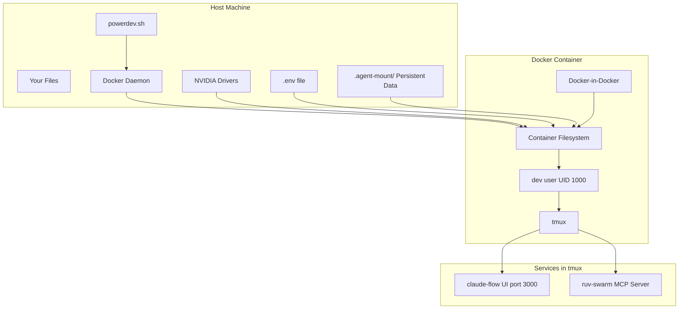

# High-Performance Development Environment for `claude-flow`

[](https://www.docker.com/)
[](https://github.com/claude-flow/claude-flow)
[](https://www.nvidia.com/en-us/gpu-cloud/)

This repository provides a fully containerized, high-performance development environment centered around **`claude-flow@alpha`**. It's designed for security, performance, and ease of use, bundling a comprehensive AI/ML stack with GPU acceleration, a robust security model, and persistent data storage.

## ✨ Key Features

- **`claude-flow@alpha` Ready**: The environment is built around `claude-flow` as the primary orchestration and development tool.
- **Comprehensive AI/ML Stack**: Includes Python 3.12 with TensorFlow, PyTorch, Keras, and more, all accelerated by CUDA 12.9.
- **GPU Accelerated**: Full NVIDIA GPU support (`--gpus all`) is enabled out-of-the-box for both ML tasks and WebGPU/Wasm workloads.
- **Robust Security Model**: The container runs with a hardened security profile, dropping all default capabilities and only adding back what is essential for development and debugging.
- **Persistent Data Storage**: Your workspace, data, logs, and outputs are safely persisted on the host machine in the `.agent-mount` directory.
- **Helper Script**: The `powerdev.sh` script simplifies all common Docker operations like building, running, and managing the container.
- **Reproducible Environment**: A single `Dockerfile` defines the entire stack, ensuring a consistent environment for every developer.

## 🏗️ Architecture Overview

The environment is designed with clear separation between the host, the container, and the services running inside.



## ⚙️ Prerequisites

- **Docker**: The latest version of Docker Engine.
- **NVIDIA GPU Drivers**: Required on the host machine for GPU acceleration inside the container.
- **Bash-compatible Shell**: For running the `powerdev.sh` script (e.g., bash, zsh).

## 🚀 Quick Start

1.  **Clone the Repository**:
    ```bash
    git clone <repository-url>
    cd <repository-directory>
    ```

2.  **Configure Environment**:
    Copy the template to create your environment file and fill in your API keys.
    ```bash
    cp env_template .env
    nano .env
    ```

3.  **Build the Image**:
    This command builds the Docker image. It only needs to be run once or when the `Dockerfile` changes.
    ```bash
    ./powerdev.sh build
    ```

4.  **Start the Container**:
    This command starts the container in interactive mode.
    ```bash
    ./powerdev.sh start
    ```
    *Alternatively, to run it in the background, use `./powerdev.sh daemon`.*

5.  **Access the UI**:
    Open your browser and navigate to **[http://localhost:3000](http://localhost:3000)** to access the `claude-flow` web interface.

6.  **Enter the Container**:
    To get a shell inside the running container, use:
    ```bash
    ./powerdev.sh exec bash
    ```

## 🧰 The `powerdev.sh` Helper Script

This script is your main entry point for managing the environment.

| Command             | Description                                                              |
| ------------------- | ------------------------------------------------------------------------ |
| `build`             | Builds the Docker image from the `Dockerfile`.                           |
| `start`             | Starts the container in interactive mode (attaches your terminal).       |
| `daemon`            | Starts the container in detached (background) mode.                      |
| `exec <cmd>`        | Executes a command inside the running container (e.g., `exec bash`).     |
| `logs`              | Tails the logs of the running container.                                 |
| `stop`              | Stops the running container.                                             |
| `rm`                | Removes the stopped container.                                           |
| `restart`           | Restarts the container.                                                  |
| `status`            | Shows a detailed status report, including health and resource usage.     |
| `health`            | Checks the container's health status (`healthy`, `unhealthy`).           |
| `watch`             | Monitors the container's health and automatically restarts it if it fails. |
| `persist`           | Backs up analysis data and logs from the container to the host.          |
| `cleanup`           | Prunes unused Docker images, networks, and volumes to free up space.     |

## 🔬 Environment Deep Dive

### Tooling & Software Stack

| Layer             | Key Packages / Features                                                                                                                                                           |
| ----------------- | --------------------------------------------------------------------------------------------------------------------------------------------------------------------------------- |
| **Primary Tool**  | **`claude-flow@alpha`**: Core orchestrator with Web UI on port 3000.                                                                                                                |
| **Supporting Tool** | **`ruv-swarm`**: Multi-agent orchestration system available as an MCP server.                                                                                                     |
| **Python 3.12**   | `tensorflow`, `torch` (+CUDA 12.9), `keras`, `xgboost`, `wgpu`, `flake8`, `pylint`.                                                                                                 |
| **Python 3.13**   | Clean sandbox for testing (`pip`, `setuptools`, `wheel` only).                                                                                                                      |
| **CUDA + cuDNN**  | Full GPU acceleration (`/usr/local/cuda`) for ML and compute tasks.                                                                                                                 |
| **Rust Toolchain**| `rustup`, `clippy`, `rustfmt`, `cargo-edit`, `sccache`. Optimized for `skylake-avx512`.                                                                                              |
| **Node.js 22 LTS**| `claude-flow@alpha`, `ruv-swarm`, and other global CLIs.                                                                                                                            |
| **Wasm / WebGPU** | WasmEdge 0.14 (+WASI-NN OpenVINO), OpenVINO 2025 runtime, Vulkan/OpenCL loaders.                                                                                                    |
| **System & Linters**| `git`, `tmux`, `shellcheck`, `hadolint`, `hyperfine`, `docker-ce` (for DinD).                                                                                                       |

### Security Model

Security is a priority. Instead of running a wide-open container, we employ a "deny-by-default" strategy:
-   `--cap-drop ALL`: All default Linux capabilities are dropped.
-   `--cap-add ...`: Only essential capabilities are added back, such as:
    -   `SYS_ADMIN`, `SYS_PTRACE`: For Docker-in-Docker and debugging tools like `strace`.
    -   `CHOWN`, `FOWNER`, etc.: For managing file permissions within the container.
    -   `NET_BIND_SERVICE`: To allow services to bind to ports below 1024 (though we use 3000).
-   **User Isolation**: The container runs as a non-root user (`dev`, UID/GID 1000) to minimize risk.
-   **Read-Only Mounts**: The host's `.ssh` directory is mounted read-only to prevent modification from within the container.
-   **Unconfined Profiles**: `apparmor:unconfined` and `seccomp:unconfined` are enabled to allow for flexible development and package installation, representing a trade-off for developer productivity in a trusted environment.

### Data Persistence & Directory Structure

Your work is never lost when the container stops. All important data is mounted from the `./.agent-mount` directory on your host machine.

```
.
├── .agent-mount/
│   ├── docker_analysis/  # For analysis outputs
│   ├── docker_data/      # For general persistent data
│   │   └── claude-flow/  # Specific data for claude-flow
│   ├── docker_logs/      # Stores container logs
│   ├── docker_output/    # For general command/script outputs
│   ├── docker_workspace/ # A persistent workspace inside the container
│   └── ext/              # Mount point for external projects (see below)
├── Dockerfile
├── powerdev.sh
├── env_template
└── README.md
```

### Configuration

The environment is configured via the `.env` file.

-   **API Keys**: `ANTHROPIC_API_KEY`, `GITHUB_TOKEN`, etc., are injected securely.
-   **Resource Limits**: You can override the auto-detected CPU and memory limits by setting `DOCKER_CPUS` and `DOCKER_MEMORY`.
-   **External Directory**: Set `EXTERNAL_DIR` to the absolute path of a project on your host machine to have it mounted at `/workspace/ext` inside the container.

## 🔄 Core Workflows

### Initial Setup & Common Patterns

Here are the most common workflow patterns for using this environment:

#### **Fresh Installation**
```bash
# 1. First time setup
cp env_template .env
nano .env                    # Configure your API keys
./powerdev.sh build            # Build the Docker image (takes 5-10 minutes)
./powerdev.sh start             # Start interactive container

# 2. Access the environment
# Web UI: http://localhost:3000
# Shell: ./powerdev.sh exec bash
```

#### **Daily Development**
```bash
# Start your development session
./powerdev.sh daemon            # Run container in background
./powerdev.sh status            # Check container health
./powerdev.sh exec bash         # Get a shell for development

# Monitor and troubleshoot
./powerdev.sh logs              # View container logs
./powerdev.sh health            # Check health status
```

#### **Maintenance & Cleanup**
```bash
# Regular maintenance
./powerdev.sh persist           # Backup analysis data
./powerdev.sh restart           # Restart unhealthy container
./powerdev.sh cleanup           # Clean up Docker resources

# Complete reset
./powerdev.sh stop              # Stop container
./powerdev.sh rm                # Remove container
./powerdev.sh build             # Rebuild image (if needed)
```

#### **Production Monitoring**
```bash
# Continuous monitoring
./powerdev.sh watch             # Auto-restart on failure (runs indefinitely)

# Manual monitoring
./powerdev.sh status            # Detailed status report
./powerdev.sh health            # Quick health check
```

### Using `claude-flow`

`claude-flow` is the primary interface for managing tasks and agents. It starts automatically when the container runs.

-   **Web UI**: The main control center is at **[http://localhost:3000](http://localhost:3000)**.
-   **CLI**: Use the CLI from within the container for scripting and quick actions.
    ```bash
    # Get a shell inside the container
    ./powerdev.sh exec bash

    # Check the system status
    claude-flow status --detailed

    # Spawn a new agent
    claude-flow agent spawn researcher --name "ResearchBot"

    # Create a new task
    claude-flow task create implementation "Build a REST API using Flask"
    ```

### Advanced `claude-flow` Setup (Manual Initialization)

For more granular control, you can initialize the `claude-flow` services manually using `tmux`. This is useful for debugging or running custom configurations.

1.  **Start the Core Services**:
    First, ensure the main container is running.
    ```bash
    ./powerdev.sh start
    ```

2.  **Initialize `claude-flow`**:
    This command sets up `claude-flow` for the first time.
    ```bash
    # One-shot upgrade and setup
    tmux new-session -d -s claude-flow-server -n claude-flow-server 'npx --y claude-flow@alpha init --force'
    ```

3.  **Configure the Swarm**:
    Use the wizard to configure the agent swarm.
    ```bash
    # Run in a new tmux session
    tmux new-session -s flow-wizard -n flow-wizard 'claude-flow hive-mind wizard'
    ```

4.  **Spawn the Hive Mind**:
    Finally, start the hive mind to begin processing tasks.
    ```bash
    # Run in another tmux session
    tmux new-session -d -s claude-flow-server -n claude-flow-server 'claude-flow hive-mind spawn "task here" --claude'
    ```

### Working with External Projects

To work on an existing project from your host machine, set the `EXTERNAL_DIR` variable in your `.env` file:

```env
# .env file
EXTERNAL_DIR="/path/to/my/project"
```

Now, when you run `./powerdev.sh start`, your project will be available inside the container at `/workspace/ext`.

## ⁉️ Troubleshooting

-   **Error: "Docker daemon not accessible"**: Ensure the Docker daemon is running on your host machine.
-   **Permission Denied on `./powerdev.sh`**: Run `chmod +x powerdev.sh` to make the script executable.
-   **`claude-flow` UI not loading**:
    1.  Check container logs with `./powerdev.sh logs`.
    2.  Ensure the container is running with `./powerdev.sh status`.
    3.  Check if another service is using port 3000 on your host.
-   **GPU not detected**:
    1.  Verify NVIDIA drivers are correctly installed on the host.
    2.  Ensure you haven't commented out the `--gpus all` flag in `powerdev.sh`.
