# Multi-Agent Docker Environment

[](https://www.docker.com/)
[](https://github.com/claude-flow/claude-flow)
[](https://modelcontextprotocol.io/)
[](https://www.python.org/)
[](https://nodejs.org/)

This project provides a sophisticated, multi-container Docker environment designed for AI agents. It orchestrates both local CLI tools and external GUI applications using the Model Context Protocol (MCP), enabling advanced AI-driven development workflows.

## ✨ Key Features

- **Dual-Container Architecture**: Separates core AI logic and CLI tools from resource-intensive GUI applications.
- **Rich Development Environment**: A polyglot environment with runtimes for Python, Node.js, Rust, and Deno, equipped with extensive tooling for AI/ML, 3D graphics, EDA, document processing, and network analysis.
- **Flexible MCP Connectivity**: Supports both WebSocket (port 3002) and high-performance TCP (port 9500) for MCP communication.
- **Comprehensive AI Tooling**: Includes a full suite of AI/ML libraries (PyTorch, TensorFlow), GPU acceleration with the CUDA Toolkit, and CLIs for major AI models (Gemini, OpenAI Codex, Anthropic Claude).
- **Advanced Hardware Acceleration**: Supports GPU-accelerated computing with CUDA and AI inference with the WasmEdge runtime and its OpenVINO backend.
- **MCP-based Orchestration**: Utilises the Model Context Protocol for seamless interaction between AI agents and a wide array of specialised tools.
- **External Application Bridges**: Employs TCP-based bridges for robust communication with external GUI applications (Blender, QGIS) running in a dedicated container.
- **Automated & Customisable Setup**: Features helper scripts for easy workspace initialisation and a user-centric configuration that aligns container permissions with the host system.

## 🎬 Demonstration

Here is a demonstration of the Blender MCP tool in action, creating a complex 3D scene programmatically.

**Screenshot:**


**Demonstration:**


## 🚀 Quick Start Guide

Get up and running with the Multi-Agent Docker Environment in under 5 minutes!

### 🚀 TL;DR

```bash
# 1. Clone & enter directory
git clone <repository-url> && cd multi-agent-docker

# 2. Build and start the environment
./multi-agent.sh build
./multi-agent.sh start

# 3. Inside the container shell, initialize the workspace
/app/setup-workspace.sh

# 4. Verify the setup
./mcp-helper.sh test-all
```

### 📋 Prerequisites Checklist

- [ ] Docker Engine installed
- [ ] Docker Compose installed
- [ ] Git installed
- [ ] 8GB+ RAM available
- [ ] 20GB+ disk space

### 🎯 Step-by-Step Guide

#### Step 1: Get the Code

```bash
git clone <repository-url>
cd multi-agent-docker
```

#### Step 2: Build and Start

The `multi-agent.sh` script simplifies the setup process.

First, build the Docker images:
```bash
./multi-agent.sh build
```

Then, start the services. This command will start the containers in the background and automatically open a shell into the `multi-agent-container`:
```bash
./multi-agent.sh start
```

You will see output indicating the containers are starting, followed by the container's command prompt:
```
Starting multi-agent container...
...
Container started! Waiting for health checks...
...
Multi-Agent Container Status:
=============================
NAME                      IMAGE                             STATUS              PORTS
gui-tools-container       multi-agent-docker_gui-tools      Up About a minute   0.0.0.0:5901->5901/tcp, 0.0.0.0:9876-9878->9876-9878/tcp
multi-agent-container     multi-agent-docker_multi-agent    Up About a minute   0.0.0.0:3000->3000/tcp, 0.0.0.0:3002->3002/tcp

Entering multi-agent container as 'dev' user...
dev@multi-agent-container:/workspace$
```

#### Step 3: Initialize Your Workspace

Once inside the container, run the setup script. This only needs to be done the first time you start the environment.
```bash
/app/setup-workspace.sh
```
This script prepares your environment by:
- ✅ Copying the latest MCP tools and helper scripts into your workspace.
- ✅ Setting the correct executable permissions.
- ✅ Installing the `claude-flow` orchestrator via `npm`.
- ✅ Verifying that all configured MCP tools are responsive.

#### Step 4: Test MCP Tools

```bash
# List all available tools
./mcp-helper.sh list-tools

# Test all tools automatically
./mcp-helper.sh test-all

# Test a specific tool (ImageMagick example)
./mcp-helper.sh test-imagemagick
```

### 🎉 Success Indicators

You'll know the environment is fully operational when you can confirm the following:

1.  **Both Containers are Running**: Open a new terminal on your host machine and run `./multi-agent.sh status`. You should see both `multi-agent-container` and `gui-tools-container` with a `Up` status.

2.  **VNC Access to GUI Tools**:
    *   Open your favorite VNC client (e.g., RealVNC, TigerVNC).
    *   Connect to `localhost:5901`.
    *   You should see the XFCE desktop environment of the `gui-tools-container`, with applications like Blender and QGIS running.

3.  **All MCP Tools Pass Tests**:
    *   Inside the `multi-agent-container` shell, run the test script:
        ```bash
        ./mcp-helper.sh test-all
        ```
    *   All tests should pass, indicating that the bridges to the external GUI applications are working correctly.

### 🔥 Common First Tasks

#### Test ImageMagick Tool

```bash
# Quick test using helper
./mcp-helper.sh test-imagemagick

# Manual test - create a golden square
./mcp-helper.sh run-tool imagemagick-mcp '{"method": "create", "params": {"width": 200, "height": 200, "color": "gold", "output": "gold_square.png"}}'
```

#### Test PBR Generator

```bash
# Generate a metal PBR texture set
./mcp-helper.sh run-tool pbr-generator-mcp '{"tool": "generate_material", "params": {"material": "brushed_metal", "resolution": "1024x1024", "output": "./pbr_textures"}}'
```

#### Test 3D Tools

The 3D tools run in the `gui-tools-container` and are accessed via a bridge.

```bash
# Create a simple cube in Blender
./mcp-helper.sh run-tool blender-mcp '{"tool": "execute_code", "params": {"code": "import bpy; bpy.ops.mesh.primitive_cube_add()"}}'

# Check the QGIS version
./mcp-helper.sh run-tool qgis-mcp '{"tool": "get_qgis_version"}'
```
You can verify the cube was created by checking the VNC session at `localhost:5901`.

### ⚡ Quick Commands Reference

These commands are run from your **host machine's terminal**.

| Command | Description |
|---|---|
| `./multi-agent.sh build` | Builds or rebuilds the Docker images. |
| `./multi-agent.sh start` | Starts both containers and enters the `multi-agent-container` shell. |
| `./multi-agent.sh stop` | Stops and removes the containers. |
| `./multi-agent.sh restart` | Restarts the containers. |
| `./multi-agent.sh status` | Shows the status of the running containers. |
| `./multi-agent.sh logs` | Tails the logs from both containers. Use `logs -f` to follow. |
| `./multi-agent.sh shell` | Enters the shell of an already running `multi-agent-container`. |
| `./multi-agent.sh cleanup` | Stops containers and removes all associated volumes (deletes all data). |

### 🆘 Quick Fixes

#### "Tool not available" error
```bash
# Re-run setup with force flag
/app/setup-workspace.sh --force
```

#### "Permission denied" error
```bash
# Fix ownership (should be automatic now)
sudo chown -R dev:dev /workspace
```

#### "Helper script not found"
```bash
# Copy helper script manually
cp /app/mcp-helper.sh ./
chmod +x ./mcp-helper.sh
```

### 🎯 Working with Claude

The setup automatically provides Claude with MCP tool knowledge. To use tools with Claude:

```bash
# Get instructions for Claude
./mcp-helper.sh claude-instructions

# Example task for Claude:
# "Using the imagemagick-mcp tool, create a 300x300 blue gradient image"
# "Using the pbr-generator-mcp tool, create realistic wood textures"
```

### 📚 Next Steps

- Read the [Architecture Documentation](./ARCHITECTURE.md)
- Explore the [Agent Briefing](./AGENT-BRIEFING.md) for Claude
- Check out available [MCP Tools](#available-mcp-tools)
- Start building with the multi-agent environment!

### 🛠️ Available MCP Tools

| Tool | Purpose | Example Use |
|------|---------|-------------|
| **imagemagick-mcp** | Image creation & manipulation | Create graphics, resize, apply effects |
| **blender-mcp** | 3D modeling & rendering | Create 3D models, render scenes |
| **qgis-mcp** | Geospatial analysis | Process maps, analyze geographic data |
| **kicad-mcp** | Electronic design | Design PCBs, create schematics |
| **ngspice-mcp** | Circuit simulation | Simulate electronic circuits |
| **pbr-generator-mcp** | PBR texture creation | Generate realistic material textures |

---

**Need help?** Use `./mcp-helper.sh claude-instructions` or check the [Architecture Guide](./ARCHITECTURE.md)!

## 🔌 MCP Connectivity

This environment offers two primary ways to connect to the Model Context Protocol (MCP) server, catering to different needs for performance and accessibility.

### MCP TCP Server (Port 9500)

For high-performance, low-latency connections, a direct TCP server is available. This is the recommended method for inter-container communication or performance-critical applications.

-   **Port**: `9500` (configurable via `MCP_TCP_PORT`)
-   **Benefits**:
    -   **Performance**: Direct TCP is significantly faster than WebSocket, with lower overhead.
    -   **Simplicity**: No WebSocket protocol layer, making it easier to use with standard TCP clients.
    -   **Compatibility**: Works with any standard TCP client library in any language.

#### Usage (from another container)

```rust
use tokio::net::TcpStream;
use tokio::io::{AsyncBufReadExt, AsyncWriteExt, BufReader};

let mut stream = TcpStream::connect("multi-agent-container:9500").await?;
let mut reader = BufReader::new(stream.try_clone().await?);

// Send request
let request = r#"{"jsonrpc":"2.0","id":"1","method":"initialize","params":{}}"#;
stream.write_all(request.as_bytes()).await?;
stream.write_all(b"\n").await?;

// Read response
let mut response = String::new();
reader.read_line(&mut response).await?;
```

#### Management Commands (inside `multi-agent-container`)

-   `mcp-tcp-start`: Start the TCP server.
-   `mcp-tcp-stop`: Stop the TCP server.
-   `mcp-tcp-status`: Check the server status.
-   `mcp-tcp-restart`: Restart the server.
-   `mcp-tcp-logs`: View server logs.
-   `mcp-tcp-test`: Run a simple connection test.

### MCP WebSocket Bridge (Port 3002)

The existing WebSocket bridge remains available for clients that require or prefer a WebSocket connection.

-   **Port**: `3002`
-   **Use Cases**: Ideal for web-based clients or systems where TCP connections are restricted.

## 📊 Services Overview

| Service Name | Container Name | Purpose | Access |
| :--- | :--- | :--- | :--- |
| `multi-agent` | `multi-agent-container` | Orchestration, AI logic, CLI tools | `docker exec` |
| `gui-tools-service` | `gui-tools-container` | Runs heavy GUI apps (Blender, QGIS, PBR Generator) | VNC on `localhost:5901` |

## 🔧 Core Development Environment

Beyond the specialised MCP tools, this environment provides a rich, general-purpose development ecosystem. For a complete list of all available command-line tools, libraries, and runtimes, please see the **[Available Tooling Reference](./TOOLS.md)**.

Key components of the core environment include:

- **AI & Machine Learning**: PyTorch, TensorFlow, CUDA Toolkit, WasmEdge with OpenVINO.
- **3D, Graphics & Media**: FFmpeg, ImageMagick, Inkscape, Colmap.
- **Document Processing**: A full TeX Live installation with `latexmk`.
- **Runtimes**: Python 3.12, Node.js 22+, Rust, and Deno.
- **Build & Dev Tools**: Git, Docker, ShellCheck, Hadolint, Tmux.
- **Networking**: `nmap`, `tcpdump`, `traceroute`, and other essential utilities.

## 📚 Detailed Documentation

Explore the following documents for a deeper understanding of the project:

| Document | Description |
|---|---|
| 🚀 **[Quick Start Guide](./QUICKSTART.md)** | Step-by-step instructions to get the environment running. |
| 🛠️ **[Available Tooling Reference](./TOOLS.md)** | A complete reference for all integrated tools, libraries, and runtimes. |
| 🏗️ **[Architecture Overview](./ARCHITECTURE.md)** | Detailed explanation of the system's dual-container architecture and MCP tool layers. |
| 🌐 **[Networking Deep Dive](./NETWORKING.md)** | Comprehensive guide to the Docker networking model and service communication. |
| 🤖 **[Agent Technical Briefing](./AGENT-BRIEFING.md)** | Documentation specifically for AI agents, detailing their capabilities and interaction patterns. |
| 🔍 **[Troubleshooting Guide](./TROUBLESHOOTING.md)** | Solutions for common issues related to networking, VNC, and tool connectivity. |
| 📜 **[License](./LICENSE)** | The CC0 1.0 Universal license for this project. |

## 🖼️ Architecture Diagram



```mermaid
graph TD
    subgraph "Host Machine"
        User_WS[User/External System] -- WebSocket --> WS_Bridge(mcp-ws-relay.js:3002)
        User_TCP[User/External System] -- TCP --> TCP_Server(mcp-tcp-server.js:9500)
        User_VNC[User/External System] -- VNC --> VNC_Access(localhost:5901)
    end

    subgraph "Docker Network: docker_ragflow"
        subgraph "multi-agent-container"
            MA_Container(Multi-Agent Container)
            TCP_Server -- Stdio --> ClaudeFlow_TCP(claude-flow)
            WS_Bridge -- Stdio --> ClaudeFlow_WS(claude-flow)
            
            MA_Container -- TCP --> Blender_Client(mcp-blender-client.js)
            MA_Container -- TCP --> QGIS_Client(qgis_mcp.py)
            MA_Container -- TCP --> PBR_Client(pbr_mcp_client.py)
            MA_Container -- Stdio --> ImageMagick(imagemagick_mcp.py)
            MA_Container -- Stdio --> KiCad(kicad_mcp.py)
            MA_Container -- Stdio --> NGSpice(ngspice_mcp.py)
            MA_Container -- Stdio --> RuvSwarm(ruv-swarm)
            MA_Container -- Stdio --> GeminiCLI(gemini-cli)
            MA_Container -- Stdio --> OpenAI_Codex(openai-codex)
            MA_Container -- Stdio --> Anthropic_Claude(anthropic-claude)
        end

        subgraph "gui-tools-container"
            GUI_Container(GUI Tools Container)
            GUI_Container -- TCP --> Blender_Server(addon.py:9876)
            GUI_Container -- TCP --> QGIS_Server(QGIS MCP Plugin:9877)
            GUI_Container -- TCP --> PBR_Server(pbr_mcp_server.py:9878)
            GUI_Container -- VNC --> XFCE_Desktop(XFCE Desktop)
            GUI_Container -- VNC --> Blender_App(Blender)
            GUI_Container -- VNC --> QGIS_App(QGIS)
            GUI_Container -- VNC --> PBR_Generator(Tessellating PBR Generator)
        end

        MA_Container -- Network --> GUI_Container
        GUI_Container -- Network --> MA_Container
    end

    style MA_Container fill:#f9f,stroke:#333,stroke-width:2px
    style GUI_Container fill:#ccf,stroke:#333,stroke-width:2px
    style WS_Bridge fill:#afa,stroke:#333,stroke-width:2px
    style TCP_Server fill:#afa,stroke:#333,stroke-width:2px
    style VNC_Access fill:#afa,stroke:#333,stroke-width:2px
```

## 📜 License

This project is released into the public domain under the [CC0 1.0 Universal (CC0 1.0) Public Domain Dedication](LICENSE).