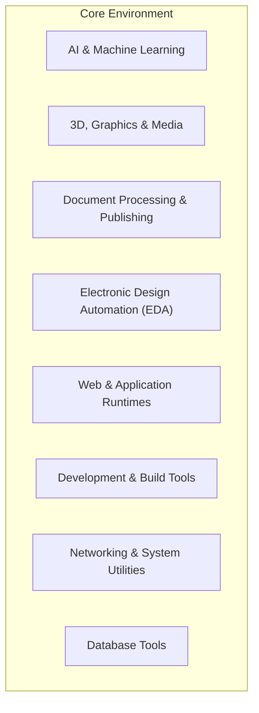

# Available Tooling Reference

This document provides a comprehensive reference for all tooling integrated into the environment. It is divided into two main sections:
1.  **Integrated Development Environment**: An overview of the general-purpose command-line tools, libraries, and runtimes available for development.
2.  **Model Context Protocol (MCP) Tool Reference**: A detailed guide to the specialised MCP tools designed for AI agent orchestration.

---

## 1. Integrated Development Environment (IDE)

The container is equipped with a rich set of tools and runtimes, transforming it into a powerful, polyglot development environment. The tooling is organised into the following categories:



### AI & Machine Learning
A comprehensive suite for modern AI development, with hardware acceleration support.

| Tool/Library | Version | Description |
| :--- | :--- | :--- |
| **NVIDIA CUDA Toolkit** | 12.9.1 | For GPU-accelerated computing on NVIDIA hardware. |
| **PyTorch** | (from requirements) | A leading deep learning framework. |
| **TensorFlow** | (from requirements) | A comprehensive platform for machine learning. |
| **WasmEdge (OpenVINO)**| Latest | A high-performance WebAssembly runtime with OpenVINO for AI inference. |
| **Modular** | Latest (pre) | A unified, extensible programming model for AI. |
| **Gemini CLI** | Latest | Command-line interface for Google's Gemini models. |
| **OpenAI Codex CLI** | Latest | Command-line interface for OpenAI's Codex models. |
| **Anthropic Claude CLI**| Latest | Command-line interface for Anthropic's Claude models. |

### 3D, Graphics & Media
A powerful collection of tools for 3D modelling, media processing, and graphics manipulation.

| Tool | Description |
| :--- | :--- |
| **FFmpeg** | The leading multimedia framework for converting, streaming, and recording. |
| **ImageMagick** | A suite for image manipulation and conversion. |
| **Inkscape** | A professional vector graphics editor (CLI). |
| **Colmap** | A general-purpose Structure-from-Motion (SfM) and Multi-View Stereo (MVS) pipeline. |
| **gltf-pipeline** | A tool for optimising glTF assets. |
| **Vulkan & OpenGL** | Core libraries (`libvulkan1`, `libgl1`, etc.) for 3D graphics. |

### Document Processing & Publishing
A full-featured environment for professional document creation and typesetting.

| Tool | Description |
| :--- | :--- |
| **Teχ Live** | A complete Teχ distribution for high-quality typesetting. |
| **latexmk** | A tool to automate the process of generating LaTeX documents. |
| **chktex** | A linter for LaTeX source code. |

### Electronic Design Automation (EDA)
A suite of open-source tools for electronics design and circuit simulation.

| Tool | Description |
| :--- | :--- |
| **KiCad** | A cross-platform and open-source electronics design automation suite. |
| **NGSpice** | A powerful open-source circuit simulator. |

### Web & Application Runtimes
A versatile environment supporting multiple modern programming languages and runtimes.

| Tool | Version | Description |
| :--- | :--- | :--- |
| **Python** | 3.12 | A high-level programming language for general-purpose development. |
| **Node.js** | 22+ | A JavaScript runtime for building scalable network applications. |
| **Rust** | Latest | A systems programming language focused on safety, speed, and concurrency. |
| **Deno** | Latest | A modern runtime for JavaScript and TypeScript. |

### Development & Build Tools
Essential tools for compiling code, managing projects, and ensuring code quality.

| Tool | Description |
| :--- | :--- |
| **Build Essential** | The fundamental package containing `gcc`, `g++`, `make`, etc. |
| **Clang** | A C/C++/Objective-C compiler front-end. |
| **Git** | The distributed version control system. |
| **Docker & Docker Compose** | For building and running containers (Docker-in-Docker). |
| **ShellCheck** | A static analysis tool for shell scripts. |
| **Hadolint** | A linter for Dockerfiles. |
| **Hyperfine** | A command-line benchmarking tool. |
| **Tmux** | A terminal multiplexer for managing multiple terminal sessions. |
| **OpenSSH Client** | For secure remote connections. |
| **unzip, 7zip** | Utilities for handling compressed archives. |

### Networking & System Utilities
A comprehensive toolkit for network analysis, debugging, and system inspection.

| Tool | Description |
| :--- | :--- |
| **nmap** | A powerful network discovery and security auditing tool. |
| **tcpdump** | A command-line packet analyser. |
| **traceroute** | A tool to trace the path of packets across a network. |
| **net-tools** | Core networking utilities like `ifconfig`, `netstat`, etc. |
| **iputils-ping** | The standard tool for testing network connectivity. |
| **jq** | A lightweight and flexible command-line JSON processor. |
| **Supervisor** | A client/server system that allows its users to monitor and control a number of processes. |

### Database Tools
Utilities for working with lightweight, embedded databases.

| Tool | Description |
| :--- | :--- |
| **SQLite3** | The command-line interface for the SQLite database engine. |
| **libsqlite3-dev** | Development headers for compiling software against SQLite. |

---

## 2. Model Context Protocol (MCP) Tool Reference

This section provides a reference for the specialised MCP tools designed for AI agent orchestration. These tools often act as wrappers or bridges to the more general tools listed above.

| Tool Name | Type | Source File | Purpose |
| :--- | :--- | :--- | :--- |
| `blender-mcp` | Bridge | `core-assets/scripts/mcp-blender-client.js` | 3D modelling and rendering via external Blender instance. |
| `qgis-mcp` | Bridge | `core-assets/mcp-tools/qgis_mcp.py` | Geospatial analysis via external QGIS instance. |
| `pbr-generator-mcp`| Bridge | `core-assets/mcp-tools/pbr_mcp_client.py` | PBR texture generation via external service. |
| `kicad-mcp` | Direct | `core-assets/mcp-tools/kicad_mcp.py` | Electronic Design Automation (EDA) using KiCad CLI. |
| `ngspice-mcp` | Direct | `core-assets/mcp-tools/ngspice_mcp.py` | Circuit simulation using NGSpice. |
| `imagemagick-mcp` | Direct | `core-assets/mcp-tools/imagemagick_mcp.py` | Image creation and manipulation using ImageMagick. |

### 2.1. `blender-mcp`

- **Type**: Bridge
- **Purpose**: Provides an interface to a running Blender instance for 3D modelling, rendering, and scene manipulation.
- **Source File**: [`core-assets/scripts/mcp-blender-client.js`](core-assets/scripts/mcp-blender-client.js:1)
- **Server Logic**: [`gui-based-tools-docker/addon.py`](gui-based-tools-docker/addon.py)

#### Description
This tool acts as a bridge, forwarding commands from Claude Flow's `stdio` to the Blender MCP TCP server running within the `gui-tools-container`. The actual tool methods are defined in the Blender Python addon (`addon.py`).

#### Methods
The `blender-mcp` bridge is generic and forwards any `tool` and `params` it receives. The available methods are defined by the TCP server. Common methods include:
- `get_scene_info`: Retrieves information about the current Blender scene.
- `get_object_info`: Retrieves details about a specific object.
- `execute_code`: Executes arbitrary Python code within Blender's context.
- `get_viewport_screenshot`: Captures the current viewport as an image.
- `download_polyhaven_asset`: Downloads and imports an asset from PolyHaven.
- `create_rodin_job`: Creates a 3D modelling job using the Hyper3D Rodin API.
- `search_sketchfab_models`: Searches for models on Sketchfab.

#### Example Usage
```bash
./mcp-helper.sh run-tool blender-mcp '{
  "tool": "execute_code",
  "params": {
    "code": "import bpy; bpy.ops.mesh.primitive_cube_add(size=2)"
  }
}'
```

### 2.2. `qgis-mcp`

- **Type**: Bridge
- **Purpose**: Provides an interface to a running QGIS instance for geospatial analysis and map generation.
- **Source File**: [`core-assets/mcp-tools/qgis_mcp.py`](core-assets/mcp-tools/qgis_mcp.py:1)
- **Server Logic**: QGIS MCP Plugin (Python) running in the `gui-tools-container`.

#### Description
This tool is a bridge that connects to a custom TCP server running as a QGIS plugin. It forwards `stdio` requests to the QGIS instance.

#### Methods
Similar to the Blender tool, the available methods are defined by the QGIS plugin. Refer to the plugin's documentation for a complete list.

#### Example Usage
```bash
./mcp-helper.sh run-tool qgis-mcp '{
  "tool": "load_layer",
  "params": {
    "path": "/workspace/data/my_shapefile.shp"
  }
}'
```

### 2.3. `pbr-generator-mcp`

- **Type**: Bridge
- **Purpose**: Generates Physically Based Rendering (PBR) texture maps using the Tessellating PBR Generator.
- **Source File**: [`core-assets/mcp-tools/pbr_mcp_client.py`](core-assets/mcp-tools/pbr_mcp_client.py:1)
- **Server Logic**: [`gui-based-tools-docker/tessellating-pbr-generator/pbr_mcp_server.py`](gui-based-tools-docker/tessellating-pbr-generator/pbr_mcp_server.py)

#### Description
This bridge connects to the PBR Generator's dedicated TCP server to create high-quality texture sets.

#### Methods
- `generate_material`: The primary method for generating textures.
  - `material` (string): The name of the material to generate (e.g., "wood", "metal").
  - `resolution` (string): The output resolution (e.g., "512x512", "1024x1024").
  - `types` (list): A list of texture types to generate (e.g., `["diffuse", "normal", "roughness"]`).
  - `output` (string): The directory path to save the generated textures.

#### Example Usage
```bash
./mcp-helper.sh run-tool pbr-generator-mcp '{
  "tool": "generate_material",
  "params": {
    "material": "fabric",
    "resolution": "1024x1024",
    "types": ["diffuse", "normal_map"],
    "output": "/workspace/textures/fabric"
  }
}'
```

### 2.4. `kicad-mcp`

- **Type**: Direct
- **Purpose**: Interacts with the `kicad-cli` to perform Electronic Design Automation (EDA) tasks.
- **Source File**: [`core-assets/mcp-tools/kicad_mcp.py`](core-assets/mcp-tools/kicad_mcp.py:1)

#### Methods
- `run_kicad_cli`: Executes a raw `kicad-cli` command.
  - `command` (string): The subcommand to run (e.g., `pcb`, `sch`).
  - `args` (list): A list of arguments for the subcommand.
  - `project_path` (string, optional): The working directory for the command.
- `create_project`: Creates a new, empty KiCad project.
  - `project_name` (string): The name for the new project.
  - `project_dir` (string, optional): The directory to create the project in.
- `export_gerbers`: Exports Gerber files from a `.kicad_pcb` file.
  - `pcb_file` (string): The path to the KiCad PCB file.
  - `output_dir` (string, optional): The directory to save the Gerber files.

#### Example Usage
```bash
./mcp-helper.sh run-tool kicad-mcp '{
  "method": "create_project",
  "params": {
    "project_name": "my_first_pcb"
  }
}'
```

### 2.5. `ngspice-mcp`

- **Type**: Direct
- **Purpose**: Runs circuit simulations using NGSpice.
- **Source File**: [`core-assets/mcp-tools/ngspice_mcp.py`](core-assets/mcp-tools/ngspice_mcp.py:1)

#### Methods
- `run_simulation`: Executes a simulation from a SPICE netlist.
  - `netlist` (string): A string containing the full SPICE netlist to simulate.

#### Example Usage
```bash
./mcp-helper.sh run-tool ngspice-mcp '{
  "method": "run_simulation",
  "params": {
    "netlist": "V1 1 0 1\nR1 1 0 1k\n.tran 1u 1m\n.end"
  }
}'
```

### 2.6. `imagemagick-mcp`

- **Type**: Direct
- **Purpose**: Performs image manipulation tasks using the ImageMagick `convert` tool.
- **Source File**: [`core-assets/mcp-tools/imagemagick_mcp.py`](core-assets/mcp-tools/imagemagick_mcp.py:1)

#### Methods
- `create`: Creates a new, simple image.
  - `width` (int): The image width.
  - `height` (int): The image height.
  - `color` (string): The background colour (e.g., "red", "#FF0000").
  - `output` (string): The path to save the output image.
- `convert`: Runs a generic `convert` command with the provided arguments.
  - `args` (list): A list of string arguments to pass to the `convert` command.

#### Example Usage
```bash
# Create a red 100x100 image
./mcp-helper.sh run-tool imagemagick-mcp '{
  "method": "create",
  "params": {
    "width": 100,
    "height": 100,
    "color": "red",
    "output": "red_square.png"
  }
}'

# Resize an image
./mcp-helper.sh run-tool imagemagick-mcp '{
  "method": "convert",
  "params": {
    "args": ["input.jpg", "-resize", "50%", "output.jpg"]
  }
}'